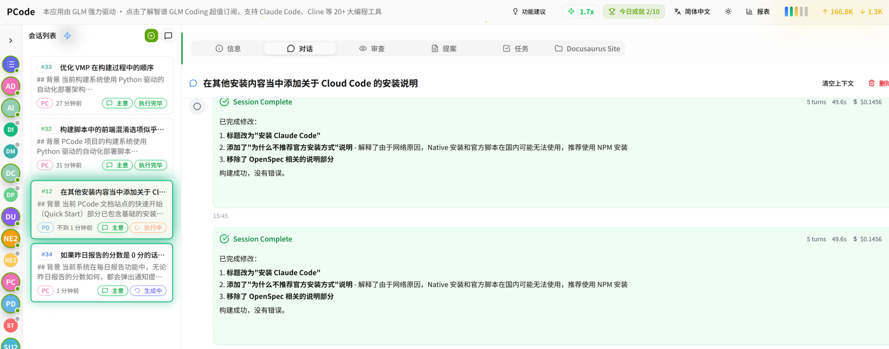
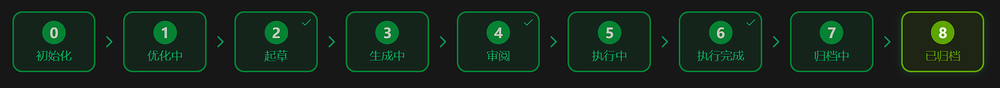
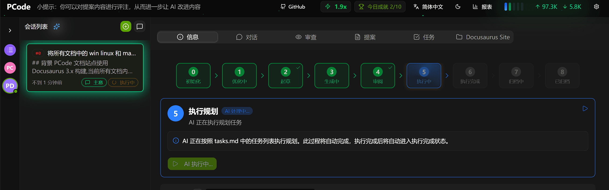
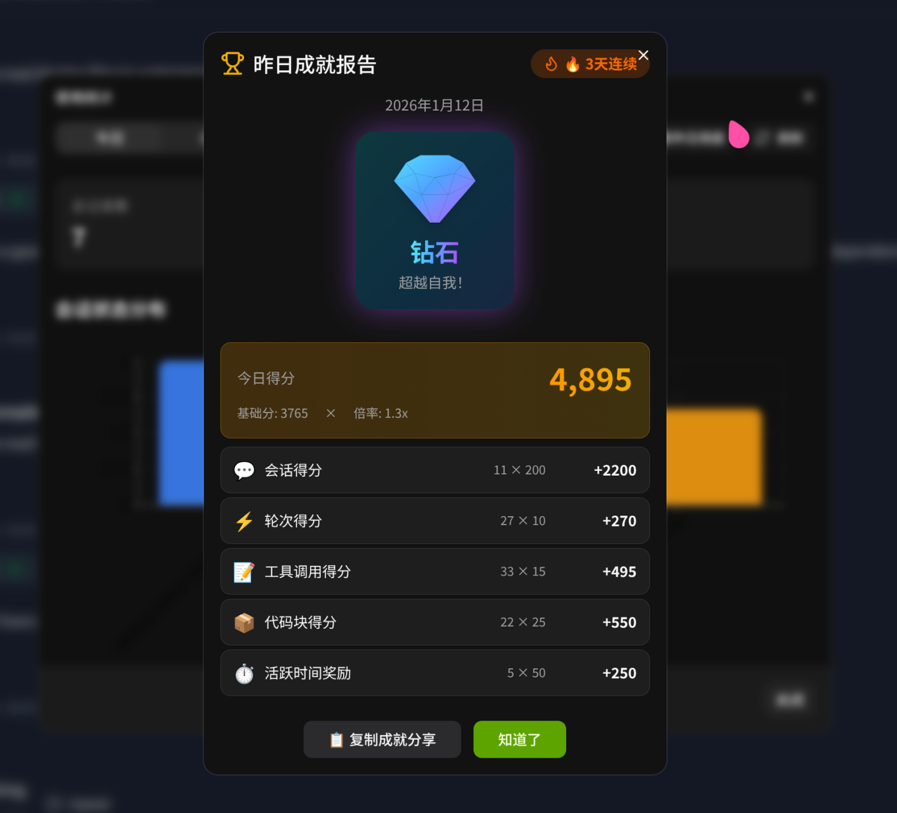
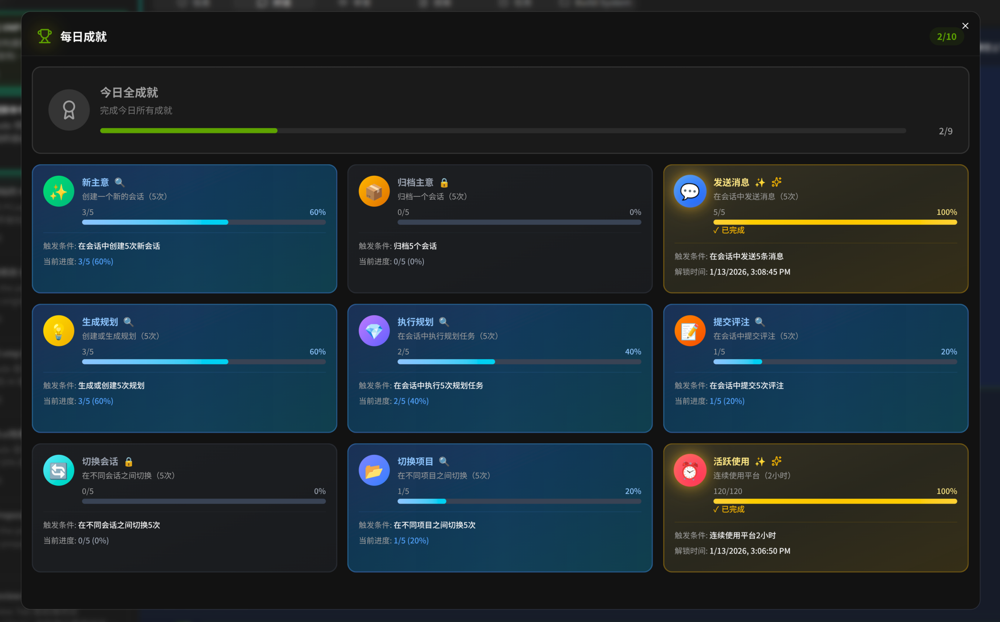

<div align="center">

<h1>智能 · 便捷 · 有趣</h1>

<p>用 AI 重新定义代码开发体验</p>



<br>

<a href="https://hagicode-org.github.io/site/">🌐 访问官网</a>

</div>

---

## 产品介绍

<table>
<tr>
<td width="60" valign="top" style="font-size: 40px;">
📖
</td>
<td>

<strong>Hagicode</strong> 是一款 <strong>AI 驱动的代码智能助手</strong>，通过创新的 <strong>OpenSpec 工作流</strong>、<strong>多线程并发操作</strong> 和 <strong>游戏化机制</strong>，为开发者带来前所未有的编码体验。

</td>
</tr>
</table>

---

## 三大核心特性

<table>
<tr>
<td align="center" width="33%">

<h3>🧠 智能</h3>
<p>OpenSpec 工作流</p>
<p><code>AI 编码效率 ↑300%</code></p>

</td>
<td align="center" width="33%">

<h3>⚡ 便捷</h3>
<p>多线程操作</p>
<p><code>额度利用率 20%→100%</code></p>

</td>
<td align="center" width="33%">

<h3>🎮 有趣</h3>
<p>游戏化机制</p>
<p><code>让编码不再枯燥</code></p>

</td>
</tr>
</table>

---

## 智能 · OpenSpec 工作流

<table>
<tr>
<td align="center">

💡<br>
<strong>IDEA</strong><br>
<small>想法构思</small>

</td>
<td align="center">→</td>
<td align="center">

📄<br>
<strong>PROPOSAL</strong><br>
<small>AI 生成提案</small>

</td>
<td align="center">→</td>
<td align="center">

🔍<br>
<strong>REVIEW</strong><br>
<small>自动评审</small>

</td>
</tr>
<tr>
<td align="center">

⚙️<br>
<strong>TASKS</strong><br>
<small>任务分解</small>

</td>
<td align="center">→</td>
<td align="center">

💻<br>
<strong>CODE</strong><br>
<small>智能编码</small>

</td>
<td align="center">→</td>
<td align="center">

🧪<br>
<strong>TEST</strong><br>
<small>自动测试</small>

</td>
</tr>
<tr>
<td align="center">

🔧<br>
<strong>REFACTOR</strong><br>
<small>代码重构</small>

</td>
<td align="center">→</td>
<td align="center">

📚<br>
<strong>DOCS</strong><br>
<small>文档生成</small>

</td>
<td align="center">→</td>
<td align="center">

✅<br>
<strong>ARCHIVE</strong><br>
<small>知识归档</small>

</td>
</tr>
</table>

<div align="center">
  
  <br><br>
  
</div>

---

## 便捷 · 多线程操作

<table>
<tr>
<td width="50%">

<strong>传统单线程</strong>

<pre>
████████░░░░░░░░░░ 20%
</pre>

</td>
<td width="50%">

<strong>Hagicode 多线程</strong>

<pre>
████████████████████████ 100%
</pre>

</td>
</tr>
</table>

<p><strong>体验提升 1.5x — 5x</strong></p>

<div align="center">
  
</div>

---

## 有趣 · 游戏化机制

<table>
<tr>
<td width="50%">

<h3>🏆 成就系统</h3>
<p>解锁 50+ 成就徽章</p>

<table>
<tr>
<td align="center">

🚀<br>
<small>初次起飞</small><br>
<code>COMMON</code>

</td>
<td align="center">

💎<br>
<small>代码大师</small><br>
<code>RARE</code>

</td>
<td align="center">

🔥<br>
<small>连续编码</small><br>
<code>EPIC</code>

</td>
<td align="center">

👑<br>
<small>传奇开发</small><br>
<code>LEGENDARY</code>

</td>
</tr>
</table>

</td>
<td width="50%">

<h3>📊 每日评级</h3>
<p>S/A/B/C 等级评定</p>

<blockquote>
<h4>今日评级: S</h4>
<table>
<tr>
<td>

Tokens<br>
<strong>1,234</strong>

</td>
<td>

成就<br>
<strong>12</strong>

</td>
<td>

效率<br>
<strong>89%</strong>

</td>
</tr>
</table>
</blockquote>

</td>
</tr>
</table>

<div align="center">
  
  <br><br>
  
</div>

---

## 📖 文档库导航

<table>
<tr>
<td width="50%">

<h3>📦 安装指南</h3>
<ul>
<li><a href="./docs/installation/docker-compose">Docker Compose 部署</a> — 推荐方式</li>
<li><a href="./docs/installation/package-deployment">包部署</a> — 灵活定制</li>
</ul>

</td>
<td width="50%">

<h3>🚀 快速入门</h3>
<ul>
<li><a href="./docs/quick-start/conversation-session">会话管理</a> — 第一个 AI 会话</li>
<li><a href="./docs/quick-start/create-first-project">创建项目</a> — 管理你的项目</li>
<li><a href="./docs/quick-start/proposal-session">提案会话</a> — OpenSpec 流程</li>
</ul>

</td>
</tr>
<tr>
<td width="50%">

<h3>🔧 相关软件安装</h3>
<ul>
<li><a href="./docs/related-software-installation/claude-code/setup-claude-code-with-zai">Claude Code + Zai</a></li>
<li><a href="./docs/related-software-installation/openspec/setup-openspec">OpenSpec</a></li>
<li><a href="./docs/related-software-installation/nodejs/installation">Node.js / PostgreSQL</a></li>
</ul>

</td>
<td width="50%">

<h3>🤝 贡献指南</h3>
<ul>
<li><a href="./docs/contributor-guide/mermaid-guide">Mermaid 图表指南</a></li>
<li><a href="./docs/contributor-guide">文档贡献规范</a></li>
</ul>

</td>
</tr>
</table>

---

## 🛠️ 文档站点开发

基于 <a href="https://docusaurus.io/">Docusaurus</a> 构建的文档站点

<table>
<tr>
<td width="50%">

<h4>快速开始</h4>

```bash
# 安装依赖
npm install

# 启动开发服务器
npm start

# 构建生产版本
npm build
```

</td>
<td width="50%">

<h4>环境要求</h4>

| 依赖 | 版本 |
|:----|:-----|
| Node.js | ≥18.0 |

<h4>项目结构</h4>

```
pcode-docs/
├── docs/          # 文档内容
│   ├── installation/
│   ├── quick-start/
│   └── ...
├── src/           # 源代码
│   ├── components/
│   ├── css/
│   └── pages/
├── static/        # 静态资源
├── docusaurus.config.ts
└── sidebars.ts
```

</td>
</tr>
</table>

---

<div align="center">

<a href="https://hagicode-org.github.io/site/">🌐 官网</a> |
<a href="https://github.com/Hagicode-org/hagicode-docs">📂 GitHub</a> |
<a href="./blog">✏️ 博客</a> |
<a href="https://docusaurus.io/">📦 Docusaurus 3.0</a>

<p>Built with ❤️ and 🎮</p>

</div>
