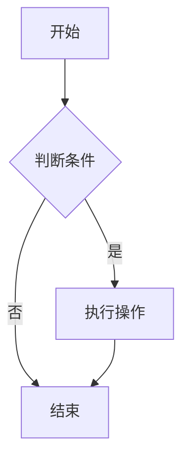
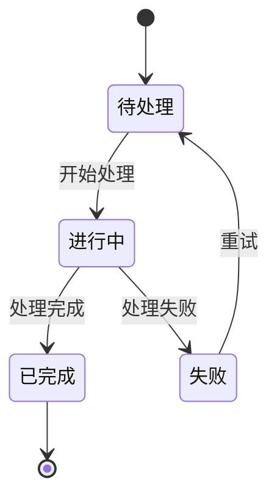
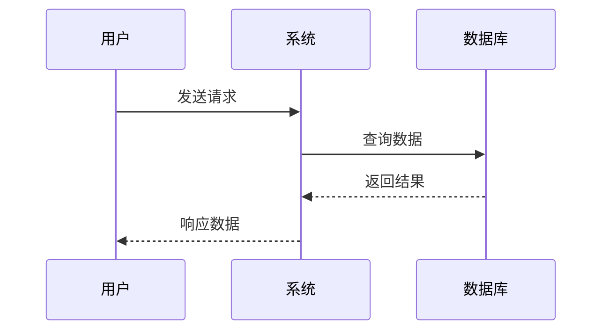
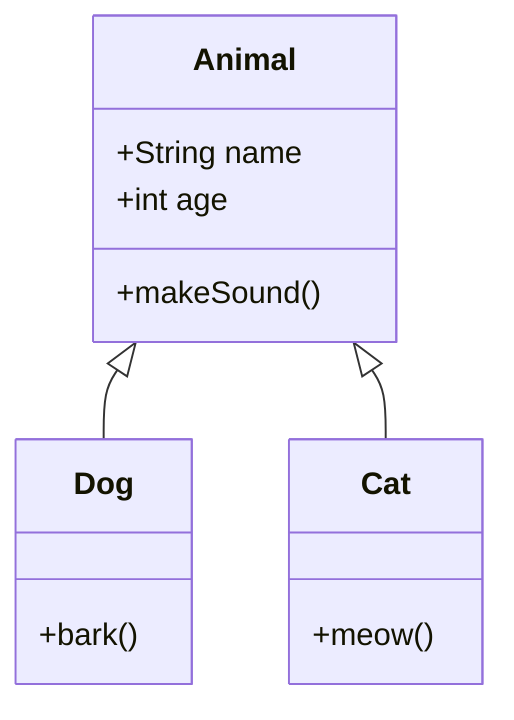
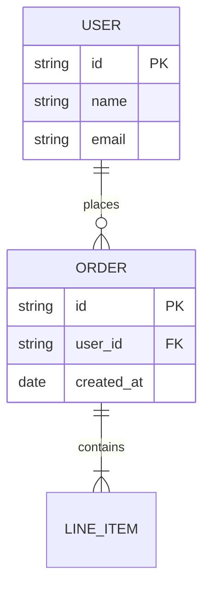
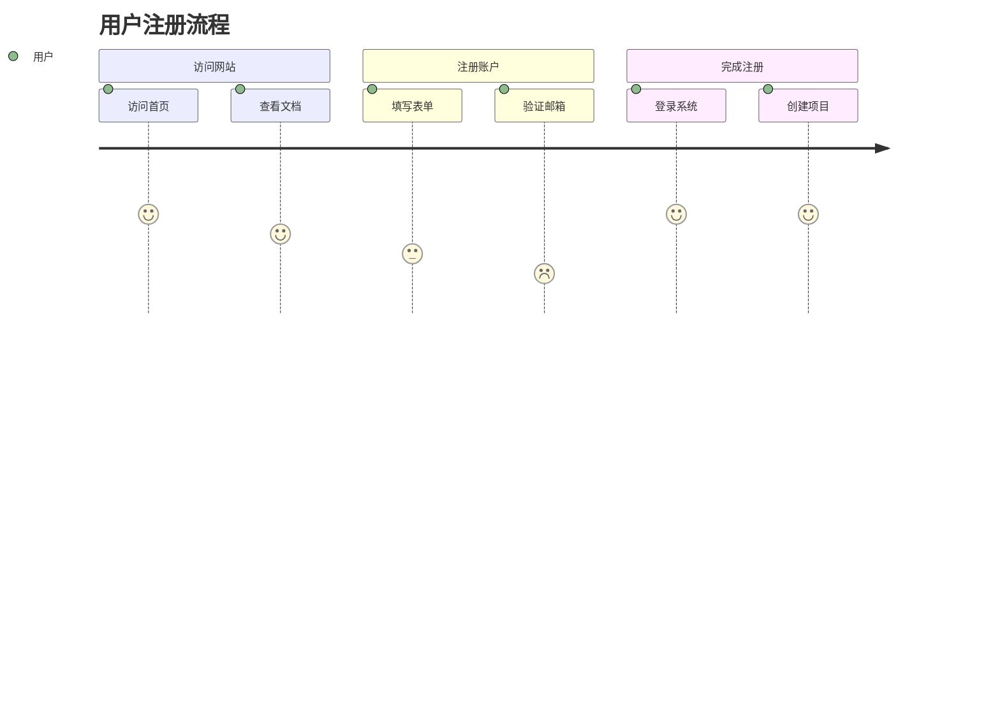
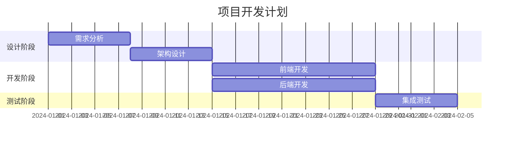
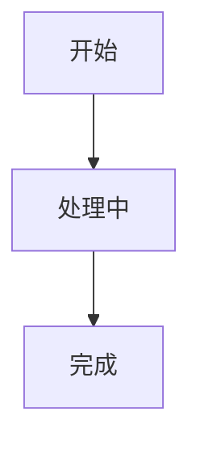

# Mermaid 图表使用指南

本文档介绍如何在 PCode 文档中使用 Mermaid 图表来创建各种技术图表。

## 什么是 Mermaid？

Mermaid 是一个基于文本的图表生成工具，允许你使用简单的文本语法创建各种类型的图表。在 PCode 文档中，Mermaid 图表会自动渲染为 SVG 图形，并支持亮色和暗色主题切换。

## 支持的图表类型

### 1. 流程图 (Flowchart)

流程图用于展示流程、决策路径和系统架构。

**语法说明：**
- `graph TD` - 从上到下的流程图（TD = Top Down）
- `graph LR` - 从左到右的流程图（LR = Left Right）
- `A[文本]` - 矩形节点
- `A{文本}` - 菱形决策节点
- `-->` - 箭头连接
- `|标签|` - 连接线上的标签

### 2. 状态图 (State Diagram)

状态图用于展示系统状态及其转换。

### 3. 时序图 (Sequence Diagram)

时序图用于展示组件之间的交互顺序。

### 4. 类图 (Class Diagram)

类图用于展示类结构和关系。

### 5. 实体关系图 (ER Diagram)

ER 图用于展示数据库架构。

### 6. 用户旅程图 (User Journey)

用户旅程图展示用户体验流程。

### 7. 甘特图 (Gantt Chart)

甘特图用于项目时间规划。

## 最佳实践

### 保持简洁

- 每个图表的节点数量建议控制在 20 个以内
- 复杂的图表应考虑拆分为多个简单图表
- 使用清晰的节点标签和连接线标签

### 使用中文标签

### 选择合适的图表类型

| 需求 | 推荐图表类型 |
|------|-------------|
| 展示流程或决策 | 流程图 (flowchart) |
| 展示状态变化 | 状态图 (stateDiagram) |
| 展示交互顺序 | 时序图 (sequenceDiagram) |
| 展示类结构 | 类图 (classDiagram) |
| 展示数据库关系 | ER 图 (erDiagram) |
| 展示时间计划 | 甘特图 (gantt) |
| 展示用户体验 | 用户旅程图 (journey) |

### 主题适配

Mermaid 图表会自动适配站点的亮色和暗色主题。无需额外配置，图表会根据用户选择的主题自动更新颜色。

## 何时使用 Mermaid vs 静态图片

### 使用 Mermaid 的场景

✅ 需要频繁更新的图表
✅ 需要版本控制的图表
✅ 相对简单的技术图表
✅ 需要支持主题切换的图表
✅ 需要可搜索的文本内容

### 使用静态图片的场景

✅ 高度复杂的手绘图表
✅ 需要特殊样式的定制图表
✅ 包含大量视觉元素的营销图表
✅ 无法用 Mermaid 表达的特殊图表

## 故障排除

### 图表未渲染

如果图表显示为代码块而不是图形：

1. 检查代码块是否使用 `mermaid` 语言标识
2. 确保 `docusaurus.config.ts` 中已配置 `mermaid` 选项
3. 清除 Docusaurus 缓存：`npm run clear`
4. 重新构建项目：`npm run build`

### 主题显示不正确

如果图表在切换主题后颜色不正确：

1. 确认配置中设置了 `theme.light` 和 `theme.dark`
2. 刷新浏览器页面
3. 清除浏览器缓存

### 构建失败

如果添加 Mermaid 图表后构建失败：

1. 检查 Mermaid 语法是否正确
2. 使用 [Mermaid 在线编辑器](https://mermaid.live/) 验证语法
3. 检查是否有未闭合的代码块

## 参考资源

- [Mermaid 官方文档](https://mermaid.js.org/)
- [Mermaid 语法指南](https://mermaid.js.org/syntax/flowchart.html)
- [Mermaid 在线编辑器](https://mermaid.live/)
- [Docusaurus Mermaid 集成文档](https://docusaurus.io/docs/markdown-features/assets#mermaid-diagrams)
