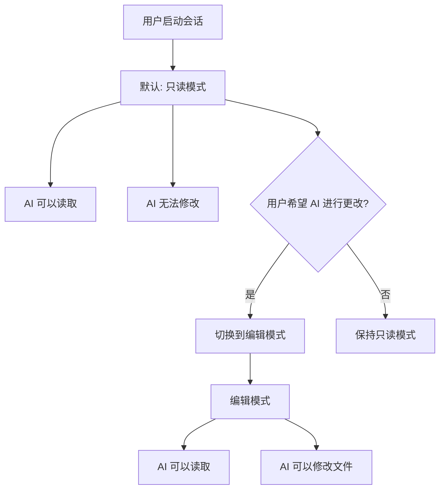
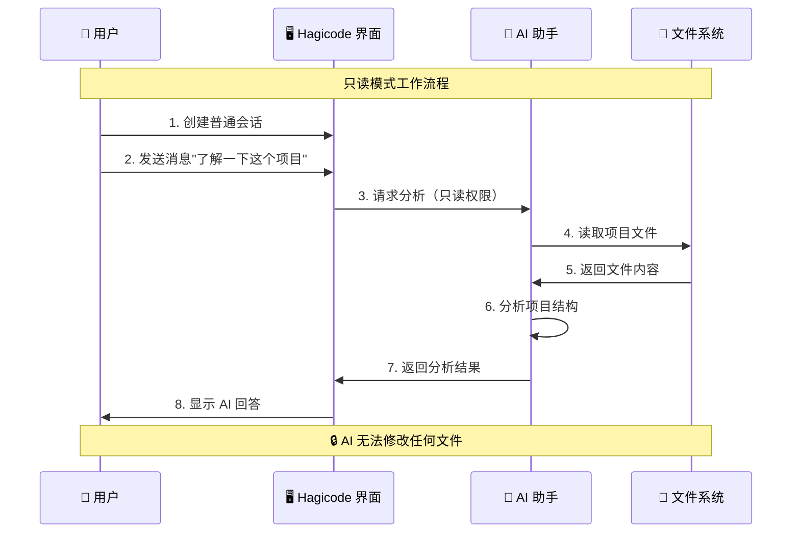
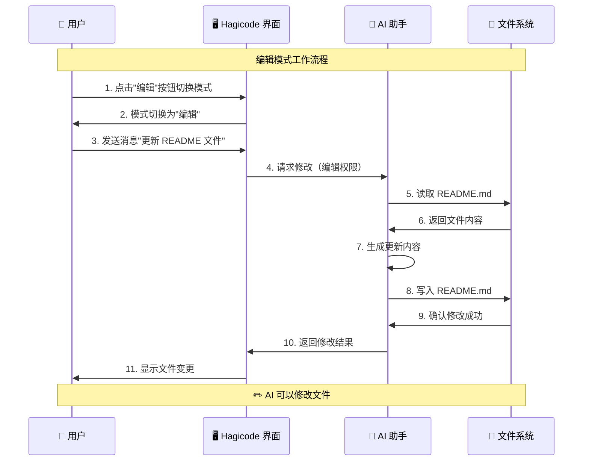

# 创建普通会话

本指南将向您展示如何在 Hagicode 中创建和使用普通会话。普通会话是与 AI 进行代码分析、审查、规划和修改任务的主要方式。

## 先决条件

在创建普通会话之前，请确保您已经：

- 安装并运行了 Hagicode（参见[安装指南](/docs/installation)）
- 创建了项目（参见[创建您的第一个项目](/docs/quick-start/create-first-project)）

## Hagicode 中的会话类型

Hagicode 支持两种会话类型，每种都针对不同的工作流程而设计：

### 普通会话（本指南）

普通会话是与 AI 的传统聊天式交互。它们适用于：

- 询问有关代码库的问题
- 获取代码解释和摘要
- 规划和设计实现
- 代码审查和反馈
- 在编辑模式下进行代码修改

### 主意会话

主意会话（在下一个指南中介绍）提供了一个结构化的工作流程，用于将想法转化为执行的变更。它们包括规划、分解和执行阶段。

## 创建普通会话

按照以下步骤创建一个新的普通会话：

### 步骤 1：点击"添加聊天"按钮

在 Hagicode 界面左侧的会话列表顶部，点击 **+ Add Chat**（添加聊天）按钮。这将直接创建一个新的普通会话。


### 步骤 2：开始聊天

创建普通会话后，在 Chat tab 下面的输入框中输入消息，就可以开始与 AI 进行 vibeCoding 了。


## 了解模式

Hagicode 普通会话以两种不同的模式运行，具有不同的功能和安全含义。

### 只读模式（默认）

当您创建新的普通会话时，它以**只读模式**启动。这是探索和理解代码库的最安全模式。

:::tip 只读模式是默认模式
新创建的普通会话默认使用只读模式，这意味着 AI 可以读取和分析您的代码，但无法进行任何修改。
:::

#### 只读模式演示

让我们通过一个实际示例来了解只读模式的工作方式。假设您想了解项目结构：

1. **发送只读消息**：在聊天输入框中输入"了解一下这个项目"
2. **AI 分析项目**：AI 会读取项目文件并分析结构
3. **查看分析结果**：AI 返回项目结构的详细说明


在只读模式下，AI 会分析您的项目并返回结构化信息：


**AI 在只读模式下可以做的事情：**

- 读取和分析项目中的文件
- 回答有关代码结构和逻辑的问题
- 提供解释和摘要
- 审查代码并提出改进建议
- 规划实现方法

**AI 在只读模式下无法做的事情：**

- 修改任何文件
- 创建新文件
- 删除现有文件
- 运行更改项目的命令

### 编辑模式

**编辑模式**授予 AI 修改项目中文件的权限。当您希望 AI 进行更改时，必须手动启用此模式。

:::caution 安全提示
编辑模式允许 AI 修改您的文件。仅当您信任 AI 的建议并希望对代码库应用更改时才启用此模式。
:::

#### 如何切换到编辑模式

普通会话默认是只读模式，您可以随时切换到编辑模式：

1. 在对话窗口中找到**模式切换按钮**（通常在输入框附近）
2. 点击按钮从"只读"模式切换到"编辑"模式
3. 模式指示器将更新以显示编辑模式已激活


#### 编辑模式演示

让我们通过一个实际示例来了解编辑模式的工作方式。假设您希望 AI 更新 README 文件：

1. **切换到编辑模式**：点击编辑按钮启用编辑权限
2. **发送编辑请求**：输入"更新 README 文件"或具体的修改要求
3. **AI 执行修改**：AI 会读取文件、应用更改并保存
4. **查看文件变化**：AI 返回修改结果，您可以查看具体变更


在编辑模式下，AI 会直接修改您的文件。您可以看到具体的变更内容：


**何时使用编辑模式：**

- 您希望 AI 实现某个功能
- 您需要应用错误修复
- 您希望执行重构
- 您需要创建新文件

### 模式切换流程

以下是只读模式和编辑模式的对比：

| 特性 | 只读模式 | 编辑模式 |
|------|---------|---------|
| **图标** | 🔒 只读 | ✏️ 编辑 |
| **默认状态** | ✅ 是 | ❌ 否 |
| **读取文件** | ✅ 支持 | ✅ 支持 |
| **分析代码** | ✅ 支持 | ✅ 支持 |
| **修改文件** | ❌ 不支持 | ✅ 支持 |
| **创建文件** | ❌ 不支持 | ✅ 支持 |
| **删除文件** | ❌ 不支持 | ✅ 支持 |
| **安全性** | 🔒 安全 | ⚠️ 需谨慎 |
| **使用场景** | 理解代码、审查、规划 | 实现功能、修复 bug |



#### 只读模式工作流程



#### 编辑模式工作流程



## 典型使用场景

### 分析和理解

在只读模式下使用普通会话来理解您的代码库。例如，您可以询问 AI "了解一下这个项目"，就像前面的[只读模式演示](#只读模式演示)中展示的那样：

- **项目摘要**："给我这个项目架构的概述"
- **代码解释**："解释身份验证系统是如何工作的"
- **架构问题**："这个代码库中使用了哪些设计模式？"

示例：
```
用户：你能解释一下用户服务如何处理注册吗？

AI：用户服务通过多步骤流程处理注册...
[注册流程的详细解释]
```

### 审查和反馈

在只读模式下获取有关代码的 AI 反馈：

- **代码审查**："审查此函数是否存在潜在问题"
- **最佳实践**："此代码是否遵循最佳实践？"
- **发现错误**："此实现中是否有任何错误？"

示例：
```
用户：审查 UserService.cs 文件是否存在潜在问题

AI：我已经审查了 UserService.cs，发现了几个可以改进的地方...
[列出具体问题和建议]
```

### 规划和设计

使用会话在实施之前规划您的工作：

- **任务分解**："分解新功能的实现"
- **实施规划**："添加缓存的最佳方法是什么？"
- **设计讨论**："这里应该使用工厂模式还是建造者模式？"

示例：
```
用户：我需要添加文件上传功能。你能帮我规划一下吗？

AI：这是实现文件上传的建议方法...
[分步实施计划]
```

### 代码更改（编辑模式）

当您准备好进行更改时，切换到编辑模式。参考前面的[编辑模式演示](#编辑模式演示)了解如何进行文件修改：

- **重构**："重构此类以使用依赖注入"
- **错误修复**："修复此方法中的空引用异常"
- **功能实现**："实现用户配置文件更新端点"

示例：
```
用户：[切换到编辑模式] 请向 CreateUser 方法添加输入验证

AI：我将向 CreateUser 方法添加验证...
[将更改应用于文件]
```

## 会话管理

### 删除会话

当您不再需要某个会话时，可以删除它以保持会话列表的整洁：

1. 在会话列表中找到要删除的会话
2. 点击会话右上角的**删除**按钮（通常是一个垃圾桶图标）
3. 确认删除操作


:::tip 删除会话的影响
删除会话仅会删除该会话的聊天历史，不会影响您的项目文件或代码。
:::

## 后续步骤

现在您了解了普通会话，请继续探索：

- **[创建第一个项目](/docs/quick-start/create-first-project)**：设置您的第一个项目
- **[提案会话](/docs/quick-start/proposal-session)**：了解提案工作流

## 有效对话的技巧

1. **具体明确**：清晰的问题会带来更好的答案
   - *好*："身份验证中间件如何验证令牌？"
   - *模糊*："身份验证是如何工作的？"

2. **提供上下文**：引用特定的文件或组件
   - *好*："在 UserService.cs 第 45 行，为什么用户被检查了两次？"
   - *模糊*："为什么有重复检查？"

3. **从只读模式开始**：在进行更改之前先探索和理解

4. **有意使用编辑模式**：仅当您准备好应用更改时才切换

5. **迭代**：使用对话历史来完善您理解和 approach
