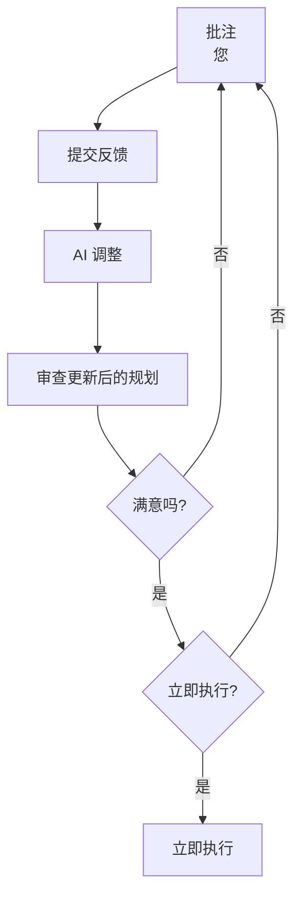

# 使用提案会话将主意转化为代码

本指南将向您展示如何在 Hagicode 中使用提案会话（也称为主意会话）。提案会话提供一个结构化的工作流程，通过 OpenSpec 的提案生命周期系统将您的想法转化为执行的变更。

## 先决条件

在使用提案会话之前，请确保您已经：

- 安装并运行了 Hagicode（参见[安装指南](/docs/installation)）
- 创建了项目并初始化了 OpenSpec（参见[创建您的第一个项目](/docs/quick-start/create-first-project)）
- 基本了解普通会话（参见[创建普通会话](/docs/quick-start/conversation-session)）

## 什么是提案会话？

提案会话是一个结构化的工作流程，指导您完成将抽象想法转化为执行代码的过程。

### 提案会话 vs 普通会话

在选择使用哪种会话类型时，理解它们之间的差异至关重要：

| 特性 | 普通会话 | 提案会话 |
|------|---------|---------|
| **工作方式** | 自由对话，即问即答 | 结构化的 9 阶段生命周期 |
| **适用场景** | 快速咨询、代码解释、简单修改 | 复杂功能开发、架构设计、多文件变更 |
| **规划程度** | 最小规划，直接执行 | 完整的提案、任务、设计文档 |
| **审查环节** | 无正式审查流程 | 三层批注系统（行内、文件、全局） |
| **迭代优化** | 依赖您主动提出改进意见 | AI 自动优化描述，支持多轮批注调整 |
| **可追溯性** | 仅保留对话历史 | 生成完整的 OpenSpec 文档（提案、任务、规范） |
| **历史利用** | 无法有效利用历史经验 | 利用"记忆碎片"系统，持续学习改进 |
| **代码质量** | 依赖单次对话质量 | 经过规划、审查、迭代，质量更高 |
| **团队协作** | 难以分享和协作 | 规划文档可共享，便于团队审查 |

### 为什么提案会话如此重要？

**1. 结构化思维，避免遗漏**

提案会话通过 9 个阶段强制您思考：
- ✅ 我到底想要实现什么？（阶段 0-1：明确需求）
- ✅ 如何实现？（阶段 3：生成详细规划）
- ✅ 规划合理吗？（阶段 4：审查和批注）
- ✅ 结果满意吗？（阶段 6：验证和调整）

**2. 多轮优化，持续改进**

不同于普通会话的"一次性输出"，提案会话支持：
- 🔄 AI 自动优化您的模糊描述
- 🔄 通过三层批注系统精确调整规划
- 🔄 执行后仍可在编辑模式中继续优化
- 🔄 多次迭代直到完全满意

**3. 记忆碎片，越用越聪明**

每次提案归档后，OpenSpec 会保存：
- 📦 提案文档（您想实现什么）
- 📦 任务清单（如何实现的步骤）
- 📦 设计文档（为什么这样设计）
- 📦 规范文件（技术规范和约束）

**下次提案时，AI 会：**
- 🧠 参考历史架构决策，保持一致性
- 🧠 复用已有的代码模式和规范
- 🧠 避免重复实现已有功能
- 🧠 理解项目的技术债务和设计权衡

**4. 团队协作，知识传承**

生成的 OpenSpec 文档可以：
- 👥 作为 Pull Request 的参考说明
- 👥 帮助新成员了解架构决策
- 👥 记录"为什么这样实现"的思考过程
- 👥 形成项目的技术知识库

### 何时使用提案会话？

**✅ 推荐使用提案会话的场景：**
- 需要创建新的功能模块
- 涉及多个文件的系统性变更
- 需要架构设计和技术选型
- 希望保留详细的设计文档
- 团队项目，需要可追溯的变更记录
- 复杂业务逻辑的实现

**❌ 推荐使用普通会话的场景：**
- 简单的代码问题咨询
- 单文件的 Bug 修复
- 快速的代码解释或学习
- 临时的代码片段生成

### 提案会话的 9 阶段生命周期

提案会话遵循定义的 9 阶段生命周期：

- **阶段 0**：初始化 - 定义您的想法
- **阶段 1**：优化中 - AI 完善您的描述
- **阶段 2**：草稿 - 审查和手动编辑
- **阶段 3**：生成中 - AI 创建详细规划
- **阶段 4**：审查 - 批注和批准变更
- **阶段 5**：执行中 - AI 实施变更
- **阶段 6**：执行完成 - 在 IDE 中验证
- **阶段 7**：归档中 - 最终确定提案
- **阶段 8**：已归档 - 生命周期完成


## 阶段 0：初始化

第一步是创建一个新想法并提供初始描述。

### 创建新想法

1. 在会话列表面板中，点击 **+ New Idea**（新想法）按钮


2. 输入提案的标题
3. 描述您想要完成的内容


### 良好初始描述的技巧

- **保持简单**：主诉不需要详细规划，用简单的语言描述问题即可
- **口语化表达**：就像和开发者对话一样，直接说出你的需求
- **聚焦问题**：说明当前遇到的问题或想要改进的地方
- **无需担心细节**：AI 会在后续阶段结合项目实际情况自动优化描述

**示例**（如截图所示）：
```
现在使用列表形式，而不是，不容易查看，请改用 tab
```

这样的简单描述就足够了！AI 会自动将其优化为完整的技术提案。

## 阶段 1：优化中（AI 自动）

提交想法后，AI 会自动处理和完善它。

### 优化期间发生的事情

AI 分析您的描述并：


- **澄清模糊的需求**
- **建议适当的技术**
- **识别潜在的边缘情况**
- **生成提案名称**

### 无需用户操作

此阶段完全自动化。您将看到加载指示器，同时 AI 正在工作。


- 生成的提案名称
- 包含附加细节的完善描述
- 识别的范围和边界

## 阶段 2：草稿（用户手动）

现在您有机会在开始规划之前审查提案。

您可以点击描述内容进行编辑，或直接点击"生成规划"继续下一步。


## 阶段 3：生成中（AI 自动）

批准草稿后，AI 会自动生成详细的实施规划。

### 生成规划过程

点击 **生成规划** 按钮后，系统会显示自动生成的状态：


您可以在对话标签页中实时查看生成进展：


### 生成的文档类型

AI 创建多个文档：

| 文档 | 类型 | 说明 |
|------|------|------|
| **提案** | 主要 | 描述要实现的功能和目标 |
| **任务** | 主要 | 具体的实施任务清单 |
| **设计** | 可选 | 架构设计文档（如需要） |
| **规范** | 参考 | OpenSpec 相关规范文件，作为记忆碎片保存 |

**评注重点**：您通常只需要对 **提案**、**任务** 和 **设计** 这三个部分进行评注即可。规范文件（specs）部分通常不需要关心。

## 阶段 4：审查（用户手动）

这是最关键的阶段，您在此审查、批注和批准实施规划。

当前阶段的展示：


您可以点击标签页查看生成的文件，并进行批注：


### 三层批注系统

Hagicode 提供三个级别的批注来提供反馈。

### 1. 行内批注

突出显示特定文本并添加评论：


### 2. 文件批注

在文档级别添加反馈：


添加批注后，您可以点击右上角按钮或直接点击"审阅"标签页，查看并提交所有批注：


### 3. 全局批注

为提案提供整体反馈：


**注意**：全局批注需要点击"保存"按钮才会生效。


### 提交批注

批注确认完毕后，您可以点击提交全部批注按钮，AI 会根据您的批注修改规划：


您可以在对话标签页中查看 AI 处理批注的过程：


### 批注循环

批注是一个迭代循环的过程。您可以不断地添加批注、提交、等待 AI 处理，然后审查更新后的规划，直到满意为止：



### 批准执行

对规划满意后：
1. 确保所有关键反馈都已处理
2. 点击 **批准并执行**
3. 提案进入执行阶段


## 阶段 5：执行中（AI 自动）

AI 现在自动实施批准的规划。

### 执行状态

执行中的面板展示效果：


### 执行期间发生的事情

AI：
- 按照规范创建新文件
- 修改现有文件以进行变更
- 逐步遵循实施规划
- 显示每个操作的进度

### 执行完成

执行完成后，您将看到：
- 创建/修改的文件摘要
- 遇到的任何警告或问题
- 查看变更的链接

## 阶段 6：执行完成

AI 已完成实施。现在是时候验证变更了。


### 在 IDE 中审查

在您首选的 IDE 中打开项目进行审查。


### 编辑模式对话

阶段 6 启用特殊的编辑模式对话，用于执行后的调整。

如果您对执行后的结果不满意，可以在对话中以编辑模式向 AI 说明需要调整的内容。AI 会继续完成编辑，直到调整结果符合您的要求为止。您可以反复进行多轮调整，直到完全满意：


### 验证清单

继续之前：
- [ ] 在 IDE 中审查所有文件变更
- [ ] 在本地测试新功能
- [ ] 运行任何现有测试
- [ ] 通过编辑模式请求任何最终调整
- [ ] 确保符合代码质量标准

## 阶段 7：归档中（AI 自动）

对实施满意后，AI 会归档提案。

### 点击"归档规划"

点击 **归档规划** 按钮完成：


### 归档期间发生的事情

AI：
- 将提案标记为完成
- 创建变更摘要
- 生成提交消息建议
- 将提案移动到归档

:::note 无代码提交
归档不会自动将代码提交到您的存储库。您应该审查变更并使用 git 手动提交。
:::


## 阶段 8：已归档

提案生命周期已完成。提案现在在归档中。


### 提交您的变更

记得提交实施的变更以及归档的规划文件：

:::重要提示
**提交归档的规划文件**

除了代码变更，您还应该将归档的规划文件提交到 Git 仓库。这些文件包括：
- 提案（proposal.md）
- 任务（tasks.md）
- 设计（design.md，如有）
- 规范文件（specs/）

**为什么需要提交规划文件？**

OpenSpec 会利用已归档的提案和规范文件作为"记忆碎片"，在后续的提案和实现过程中参考这些历史记录。这样：
1. ✅ AI 可以了解项目的架构决策和历史变更
2. ✅ 保持代码风格和模式的一致性
3. ✅ 避免重复实现已有的功能
4. ✅ 每次提案的效果会越来越好

即使不提交到中心仓库，至少也要确保在本地保留这些文件，以便 OpenSpec 能够持续学习和改进。
:::

```bash
cd /path/to/your/project
# 添加代码变更和规划文件
git add .
git commit -m "添加 JWT 身份验证系统

- 实现带有 JWT 令牌生成的 AuthService
- 添加用于路由保护的 JWT 中间件
- 创建身份验证端点（注册、登录、注销）
- 集成 bcrypt 进行密码哈希
- 归档提案规划：openspec/changes/add-jwt-auth/"
```

## 状态参考

| 阶段 | 名称 | 类型 | 描述 |
|------|------|------|------|
| 0 | 初始化 | 用户 | 创建带有标题和描述的新想法 |
| 1 | 优化中 | AI | AI 完善描述并生成名称 |
| 2 | 草稿 | 用户 | 审查并手动编辑提案 |
| 3 | 生成中 | AI | AI 创建详细的实施规划 |
| 4 | 审查 | 用户 | 批注规划并批准执行 |
| 5 | 执行中 | AI | AI 实施批准的变更 |
| 6 | 执行完成 | 用户 | 验证变更并进行调整 |
| 7 | 归档中 | AI | AI 完成并归档提案 |
| 8 | 已归档 | - | 提案生命周期完成 |

## 参考资源

了解更多关于 OpenSpec 的信息：

- **OpenSpec 规范**：了解 OpenSpec 的工作原理和最佳实践
- **OpenSpec 文档结构**：学习如何组织和管理提案、任务和规范文件
- **OpenSpec 记忆碎片系统**：深入了解如何利用历史提案改进未来的开发
