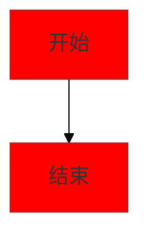

# 提案图表

提案图表功能提供可视化的方式展示 OpenSpec 提案的结构和流程。

## 功能概述

提案图表提供了以下功能：

- **流程图**：显示提案的处理流程
- **架构图**：展示系统架构变更
- **依赖图**：显示组件依赖关系
- **交互式查看**：支持缩放、平移和全屏查看
- **导出功能**：导出图表为图片

## 图表类型

### 流程图 (Flowchart)

显示提案的处理流程和步骤：

- **起始节点**：提案的开始点
- **处理节点**：各个处理步骤
- **决策节点**：需要决策的分支点
- **终止节点**：提案的结束点

**适用场景**：
- 展示提案执行流程
- 显示决策分支
- 说明处理步骤

### 序列图 (Sequence Diagram)

显示组件之间的交互序列：

- **参与者**：涉及的组件或服务
- **消息**：组件之间的消息传递
- **时序**：消息的时间顺序
- **返回**：方法的返回值

**适用场景**：
- 展示 API 调用流程
- 显示组件交互
- 说明数据流向

### 类图 (Class Diagram)

显示类的结构和关系：

- **类**：涉及的类和接口
- **属性**：类的属性和字段
- **方法**：类的方法和函数
- **关系**：类之间的关系（继承、关联等）

**适用场景**：
- 设计软件架构
- 展示类结构
- 说明关系和依赖

### 状态图 (State Diagram)

显示系统或组件的状态转换：

- **状态**：各种可能的状态
- **转换**：状态之间的转换
- **事件**：触发转换的事件
- **动作**：转换时执行的动作

**适用场景**：
- 设计状态机
- 展示状态转换
- 说明业务流程

### 实体关系图 (ER Diagram)

显示数据模型和关系：

- **实体**：数据库表或实体
- **属性**：实体的属性
- **关系**：实体之间的关系
- **基数**：关系的基数

**适用场景**：
- 设计数据库架构
- 展示数据模型
- 说明数据关系

## 图表渲染

### 自动生成

提案创建时，系统会自动生成相关图表：

- 基于提案内容分析
- 生成合适的图表类型
- 自动布局和美化

### 手动编辑

您可以手动编辑图表：

1. 打开 OpenSpec 文件
2. 找到图表的 Mermaid 代码
3. 编辑图表定义
4. 保存后自动更新渲染

## 交互式查看

### 缩放和平移

- **缩放**：使用鼠标滚轮或缩放按钮
- **平移**：拖动图表进行平移
- **重置**：一键重置视图

### 全屏查看

点击全屏按钮进入全屏模式：

- **更大显示**：全屏显示图表
- **专注查看**：隐藏其他界面元素
- **详细查看**：适合查看大型图表

### 节点信息

悬停在节点上可以查看详细信息：

- **节点名称**：节点的标识
- **节点类型**：节点的类型
- **节点属性**：节点的属性和配置
- **相关链接**：相关文档和链接

## 图表样式

### 主题适配

图表自动适配当前主题：

- **浅色主题**：使用浅色配色方案
- **深色主题**：使用深色配色方案
- **动态切换**：实时响应主题切换

### 自定义样式

您可以为图表指定自定义样式：

## 图表导出

### 导出为 PNG

1. 打开图表的全屏查看
2. 点击导出按钮
3. 选择 PNG 格式
4. 保存到本地

### 导出为 SVG

1. 打开图表的全屏查看
2. 点击导出按钮
3. 选择 SVG 格式
4. 保存到本地

:::info 注意

SVG 格式支持无损缩放，适合打印和高质量展示。

:::

## Mermaid 语法

PCode 使用 Mermaid.js 渲染图表，支持完整的 Mermaid 语法。

### 基础示例

**流程图**：
\`\`\`mermaid
graph TD
    A[开始] --> B{决策}
    B -->|是| C[执行 A]
    B -->|否| D[执行 B]
    C --> E[结束]
    D --> E
\`\`\`

**序列图**：
\`\`\`mermaid
sequenceDiagram
    participant 用户
    participant 系统
    用户->>系统: 发送请求
    系统-->>用户: 返回响应
\`\`\`

### 高级功能

- **子图**：使用 `subgraph` 创建子图
- **样式**：使用 `classDef` 定义样式
- **链接**：添加点击链接
- **图标**：使用 Emoji 和图标

## 最佳实践

### 设计图表

- **保持简洁**：避免过度复杂的图表
- **清晰标识**：使用描述性的标签
- **合理布局**：确保布局清晰易读
- **一致性**：保持风格一致

### 图表尺寸

- **适当大小**：不要创建过大的图表
- **分而治之**：复杂图表拆分为多个
- **重点突出**：突出重要部分

### 文档说明

- **添加说明**：为图表添加文字说明
- **解释符号**：说明特殊符号的含义
- **提供示例**：提供使用示例

## 性能优化

### 大型图表

对于大型图表：

- **分页显示**：将图表分页显示
- **懒加载**：按需加载图表内容
- **简化视图**：提供简化视图选项

### 渲染优化

- **虚拟化**：大型图表使用虚拟渲染
- **缓存**：缓存渲染结果
- **按需渲染**：只渲染可见部分

## 相关功能

- [提案概述](./overview.md) - 了解 OpenSpec 提案的基本概念
- [创建提案](./creating-proposals.md) - 了解如何创建提案
- [消息渲染](../conversation/message-rendering.md) - 了解 Mermaid 图表的渲染功能
