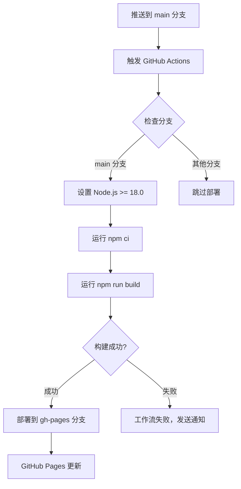
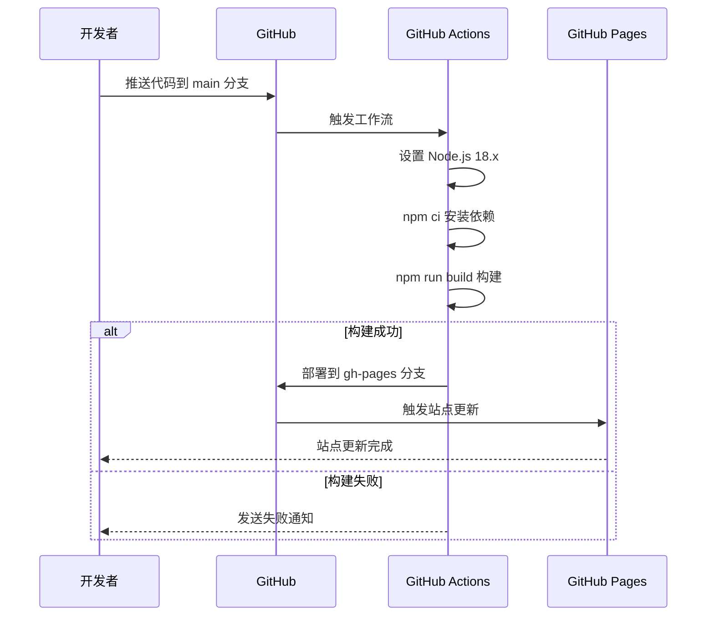

# Change: 自动发布 GitHub Page

## Why

当前文档站点缺少自动化部署流程。每次更新文档后，需要手动执行 `npm run build` 并部署，增加了维护成本和人为错误的风险。

通过添加 GitHub Actions 工作流，可以实现推送到 `main` 分支时自动构建和部署到 GitHub Pages，实现持续集成/持续部署（CI/CD）。

## What Changes

- **添加 GitHub Actions 工作流配置文件**
  - 在 `.github/workflows/` 目录下创建 `deploy.yml`
  - 配置触发条件：推送到 `main` 分支时自动执行

- **构建步骤配置**
  - 使用 Node.js >= 18.0 环境（符合项目 `package.json` 的 engines 要求）
  - 运行 `npm ci` 安装依赖（确保依赖版本一致性）
  - 执行 `npm run build` 生成静态站点到 `build/` 目录

- **部署步骤配置**
  - 使用 GitHub Actions 内置的 `peaceiris/actions-gh-pages` action
  - 将 `build/` 目录内容部署到 GitHub Pages
  - 配置部署目标分支为 `gh-pages`（GitHub Pages 标准做法）

- **GitHub 权限配置**
  - 工作流需要 `contents: write` 和 `pages: write` 权限
  - 需要在仓库设置中启用 GitHub Pages 功能

## UI Design Changes

不适用。此变更仅影响 CI/CD 流程，不涉及用户界面。

## Code Flow Changes

## Impact

- **影响的功能模块**: docusaurus-site
- **影响的代码文件**:
  - 新增: `.github/workflows/deploy.yml`
- **影响的配置**:
  - GitHub 仓库设置需要启用 GitHub Pages
  - GitHub Actions 权限配置
- **收益**:
  - 实现文档站点的持续集成/持续部署（CI/CD）
  - 减少手动部署操作，降低维护成本
  - 确保 GitHub Pages 内容与主分支代码同步
- **注意事项**:
  - 需在 GitHub 仓库设置中启用 GitHub Pages 功能
  - 需要配置 GitHub Actions 权限（`contents: write` 和 `pages: write`）
  - 构建过程符合项目的 `onBrokenLinks: 'throw'` 严格模式要求
