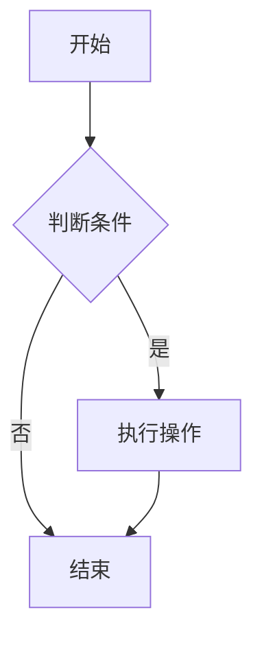
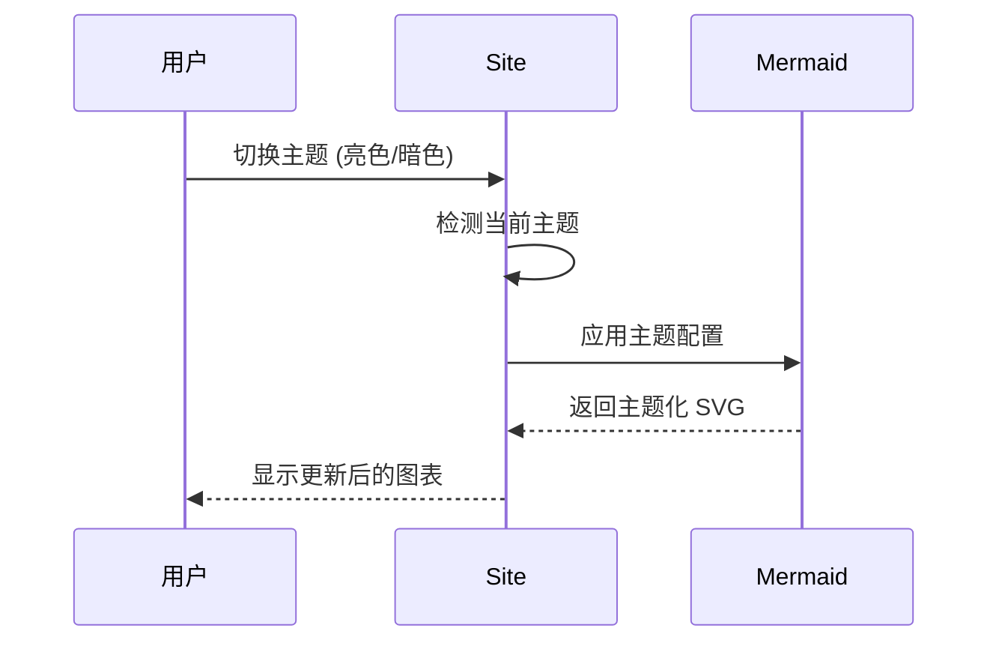

# Change: Optimize Flowchart Display with Mermaid

## Why

The current Docusaurus documentation site lacks a standardized approach for displaying flowcharts, state diagrams, and other technical diagrams. Using static images for diagrams creates maintenance challenges:

1. **Maintenance difficulty**: Static images are difficult to update and version control
2. **Inconsistent display**: Images may not render well across different devices and themes
3. **No accessibility**: Text-based diagrams are more accessible to screen readers
4. **Limited interactivity**: Static diagrams cannot be interactive or searchable
5. **Team collaboration overhead**: Image files require separate editing tools and cannot be edited directly in markdown

## What Changes

### Primary Changes

- **ADDED** Enable Mermaid diagram support in `docusaurus.config.ts`
- **ADDED** Configure Mermaid theme settings for light and dark modes
- **ADDED** Document Mermaid usage guidelines in contributor documentation

### Configuration Changes

**Before:**
```typescript
// docusaurus.config.ts - No Mermaid configuration
themeConfig: {
  // ... existing config
}
```

**After:**
```typescript
// docusaurus.config.ts - Add Mermaid configuration
themeConfig: {
  // ... existing config
  mermaid: {
    theme: {
      light: 'base',
      dark: 'dark',
    },
  },
}
```

### Supported Diagram Types

- **Flowcharts** (`graph`, `flowchart`) - Process flows and decision trees
- **State Diagrams** (`stateDiagram`) - State transitions and lifecycle
- **Sequence Diagrams** (`sequenceDiagram`) - Interaction sequences between components
- **Class Diagrams** (`classDiagram`) - UML class structures
- **Entity Relationship Diagrams** (`erDiagram`) - Database schemas
- **User Journey** (`journey`) - User experience flows
- **Gantt Charts** (`gantt`) - Project timelines

### Usage Example

```markdown

```

## UI Design Changes

Not applicable - this is a documentation capability enhancement, not a UI component change.

## Code Flow Changes

### Mermaid Integration Flow


### Theme-Switching Flow



## Impact

- **Affected specs:** docusaurus-site
- **Affected code:**
  - `docusaurus.config.ts` - Add mermaid theme configuration
  - `openspec/project.md` - Update documentation conventions section
  - All future MDX documentation files - Can now use Mermaid diagrams

## Benefits

1. **Standardization**: Unified diagram syntax across all documentation
2. **Maintainability**: Diagrams are version-controlled alongside markdown content
3. **Responsiveness**: Mermaid diagrams automatically adapt to screen size and theme
4. **Accessibility**: Text-based content is more accessible to screen readers
5. **Developer Experience**: Edit diagrams directly in markdown without external tools
6. **Searchability**: Diagram text content is indexed and searchable

## Risks

1. **Learning curve**: Team members need to learn Mermaid syntax
   - **Mitigation**: Provide syntax documentation and example templates in contributor guide

2. **Complex diagram limitations**: Very complex diagrams may be difficult to express in Mermaid
   - **Mitigation**: Keep diagrams simple; for highly complex visualizations, static images remain an option

3. **Rendering performance**: Pages with many diagrams may load slower
   - **Mitigation**: Limit number of diagrams per page; use lazy loading if needed

4. **Browser compatibility**: Some older browsers may have issues with SVG rendering
   - **Mitigation**: Mermaid has broad browser support; document minimum browser requirements

## Alternatives Considered

### Alternative 1: Continue using static images

**Rationale for rejection**:
- Does not address maintenance and version control issues
- Images cannot adapt to themes
- Requires external editing tools

### Alternative 2: Use PlantUML

**Rationale for rejection**:
- Requires Java runtime for rendering
- Not natively supported by Docusaurus
- Less intuitive syntax than Mermaid

### Alternative 3: Use external diagramming services (e.g., draw.io)

**Rationale for rejection**:
- External dependencies add complexity
- Requires iframe embedding which breaks site cohesion
- Cannot be edited directly in markdown

## Migration Plan

### Forward Migration

1. Add Mermaid configuration to `docusaurus.config.ts`
2. Test build with `npm run build` to verify configuration
3. Create Mermaid usage documentation in contributor guide
4. (Optional) Migrate existing static image diagrams to Mermaid
5. Validate theme switching works correctly for diagrams

### Rollback Migration

1. Remove `mermaid` configuration from `docusaurus.config.ts`
2. Any Mermaid diagrams will display as code blocks instead of rendered diagrams
3. Revert to static images if migration was performed

## Open Questions

1. **Should we migrate existing diagrams?**
   - **Approach**: Assess existing diagrams first; prioritize frequently-viewed pages

2. **Default diagram complexity limit?**
   - **Approach**: Document best practices; recommend keeping diagrams under 20 nodes

3. **Need custom Mermaid plugins?**
   - **Approach**: Start with default configuration; add extensions only if needed

## References

- Mermaid official documentation: https://mermaid.js.org/
- Docusaurus Mermaid integration: https://docusaurus.io/docs/markdown-features/assets#mermaid-diagrams
- Mermaid syntax guide: https://mermaid.js.org/syntax/flowchart.html
- Existing spec: `openspec/specs/docusaurus-site/spec.md`
- Project conventions: `openspec/project.md`
