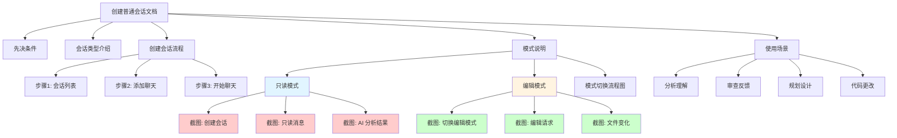
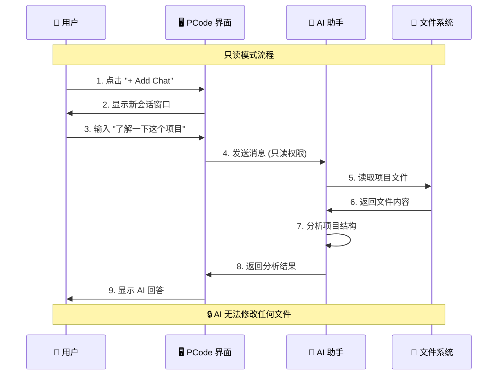
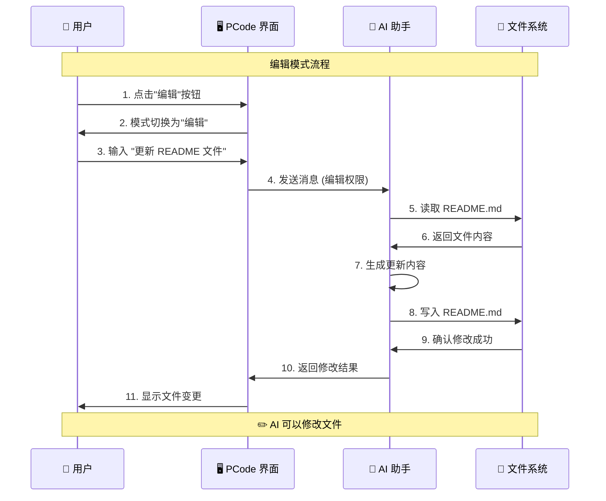

# Design Document: 更新创建普通会话的截图

## Context

本文档记录"创建普通会话"文档的截图更新设计决策。该文档是 PCode 快速开始指南的一部分,旨在帮助用户理解如何创建和使用普通会话,以及只读模式和编辑模式的区别。

### Current State
- **文档位置**: `docs/quick-start/conversation-session.md`
- **截图目录**: `static/img/create-normal-session/` (已存在 9 张截图)
- **文档结构**: 完整的文字说明,缺少实际操作截图
- **用户痛点**: 难以通过纯文字理解两种模式的权限差异

### Stakeholders
- **目标用户**: PCode 新用户,需要快速理解会话创建和模式切换
- **维护者**: 文档维护团队,需要清晰的文档结构
- **开发者**: PCode 开发团队,需要准确的用户指南

## Goals / Non-Goals

### Goals
1. ✅ 通过实际截图展示只读模式和编辑模式的工作流程
2. ✅ 提供清晰的操作步骤指引
3. ✅ 突出两种模式的权限差异和安全提示
4. ✅ 保持文档的可维护性和一致性
5. ✅ 提升用户学习体验,减少理解成本

### Non-Goals
- ❌ 重新设计 PCode 界面或功能
- ❌ 修改 Docusaurus 配置或主题
- ❌ 创建新的截图 (已由用户提前提供)
- ❌ 添加视频或动画 (本次不包含)
- ❌ 改变文档的基本结构 (仅在现有结构上增强)

## Decisions

### Decision 1: 截图组织方式

**选择**: 在现有文档结构中嵌入截图,而不是创建独立的图文教程

**理由**:
- 用户可以在阅读操作说明时直接看到对应的界面
- 减少文档跳转,提升阅读连贯性
- 保持与现有 Docusaurus 文档结构的一致性

**替代方案**:
- ❌ 创建独立的图片教程页面 - 增加维护成本,用户体验割裂
- ❌ 使用图片轮播 - 不适合教程性质的文档

### Decision 2: 截图命名规范

**选择**: 使用描述性的中文文件名,保持现有的 kebab-case 格式

**示例**:
- `1.点击新建会话按钮，创建普通会话.png`
- `2.点击普通会话，可以在 Chat tab 下面的输入框进行 vibeCoding.png`

**理由**:
- 文件名即说明,便于维护和查找
- 符合项目现有的命名约定
- 中文文件名对中文用户更友好

### Decision 3: 截图放置策略

**选择**: 按照操作流程顺序放置截图,每个关键步骤配一张截图

**放置位置**:
1. **创建会话流程** (步骤 1-3)
   - 在"创建普通会话"章节添加截图 1-2
2. **只读模式演示** (步骤 4-5)
   - 在"只读模式（默认）"章节添加截图 3-4
3. **编辑模式演示** (步骤 6-7)
   - 在"编辑模式"章节添加截图 5-7
4. **会话管理** (步骤 9)
   - 在文档末尾添加删除会话的截图 9

**理由**:
- 符合用户的操作流程
- 每个截图都有明确的上下文
- 便于用户按步骤跟随操作

### Decision 4: 图片优化策略

**选择**: 使用 Docusaurus 的原生图片支持,不引入额外的图片优化工具

**技术方案**:
- 使用 Markdown 标准图片语法: ``
- 利用 Docusaurus 的 `static/` 目录映射
- 启用图片懒加载 (Docusaurus 默认支持)

**理由**:
- 减少构建依赖
- 保持文档简洁
- Docusaurus 已有良好的图片处理能力

## UI/UX Design

### 文档结构设计



### 只读模式用户流程



### 编辑模式用户流程



### 模式对比表格设计

```markdown
| 特性 | 只读模式 | 编辑模式 |
|------|---------|---------|
| **图标** | 🔒 只读 | ✏️ 编辑 |
| **默认状态** | ✅ 是 | ❌ 否 |
| **读取文件** | ✅ 支持 | ✅ 支持 |
| **分析代码** | ✅ 支持 | ✅ 支持 |
| **修改文件** | ❌ 不支持 | ✅ 支持 |
| **创建文件** | ❌ 不支持 | ✅ 支持 |
| **删除文件** | ❌ 不支持 | ✅ 支持 |
| **安全性** | 🔒 安全 | ⚠️ 需谨慎 |
| **使用场景** | 理解代码、审查、规划 | 实现功能、修复 bug |
```

### 截图样式指南

```markdown
## 标准截图格式

### 描述性标题
简短的一句话说明本截图展示的内容。


**操作步骤**:
1. 第一步操作
2. 第二步操作
3. 第三步操作

**注意**: 重要的提示信息使用 callout 格式

:::tip 提示
有用的提示信息
:::

:::caution 警告
需要注意的安全信息
:::
```

## Technical Design

### 文件结构

```
pcode-docs/
├── docs/
│   └── quick-start/
│       └── conversation-session.md    # 主要更新的文档
├── static/
│   └── img/
│       └── create-normal-session/     # 截图目录 (已存在)
│           ├── 1.点击新建会话按钮，创建普通会话.png
│           ├── 2.点击普通会话，可以在 Chat tab 下面的输入框进行 vibeCoding.png
│           ├── 3.发送内容之后，可以在会话区看到当前 AI 的回答.png
│           ├── 4.最后可以看到 AI 的执行结果.png
│           ├── 5.普通会话默认是只读的，可以点击编辑按钮进行模式切换.png
│           ├── 6.发送带有编辑权限消息的展示效果.png
│           ├── 7.刚才我们进行编辑之后的 README 变化.png
│           ├── 9.点击右上角的删除会话，可以删除这个普通会话.png
│           └── ... (其他截图)
└── openspec/
    └── changes/
        └── create-normal-session-screenshots/
            ├── proposal.md              # ✅ 本提案
            ├── tasks.md                 # ✅ 任务清单
            ├── design.md                # ✅ 本设计文档
            └── specs/
                └── docusaurus-site/
                    └── spec.md          # 待创建: 文档规范增量
```

### 图片引用路径规则

**Docusaurus Static 资源映射**:
- 源路径: `static/img/create-normal-session/file.png`
- 文档引用: `/img/create-normal-session/file.png`
- 构建后: `/img/create-normal-session/file.png`

**正确示例**:
```markdown

```

**错误示例**:
```markdown
<!-- ❌ 错误: 不应该包含 static/ -->


<!-- ❌ 错误: 不应该使用相对路径 -->

```

### Markdown 图片语法增强

**基础图片**:
```markdown

```

**带标题的图片**:
```markdown

```

**响应式图片** (使用 Docusaurus 组件):
```markdown
import Image from '@theme/Image';

<Image
  src="/img/create-normal-session/file.png"
  alt="描述"
  title="标题"
/>
```

### 文档内容更新策略

**章节映射**:

| 文档章节 | 对应截图 | 内容增强 |
|---------|---------|---------|
| 创建普通会话 | 1-2 | 添加截图和分步说明 |
| 只读模式（默认） | 3-4 | 添加实际案例演示 |
| 编辑模式 | 5-7 | 添加编辑流程截图 |
| 典型使用场景 | 3-7 | 引用相关截图 |
| 会话管理 | 9 | 添加删除会话截图 |

### 性能优化考虑

**图片加载优化**:
1. **懒加载**: Docusaurus 默认启用 `loading="lazy"`
2. **图片大小**: 控制单张截图 < 500KB
3. **图片格式**: PNG (已有截图), 如需优化可考虑 WebP
4. **CDN 缓存**: 静态资源适合 CDN 加速

**文档性能指标**:
- 目标加载时间: < 2s (包含所有图片)
- 图片总大小: < 3MB (整个文档)
- 首屏内容: < 1s (第一张截图加载)

## Risks / Trade-offs

### Risk 1: 图片路径错误

**风险**: 图片路径配置错误导致截图无法显示

**缓解措施**:
- ✅ 使用 Docusaurus 标准路径规范
- ✅ 本地构建验证所有图片链接
- ✅ 使用绝对路径 `/img/` 而非相对路径
- ✅ 添加 broken link 检测到 CI/CD

### Risk 2: 截图尺寸不一致

**风险**: 不同截图的尺寸、分辨率不一致影响文档美观

**缓解措施**:
- ✅ 使用统一的截图工具和设置
- ✅ 通过 CSS 统一图片显示样式 (如需要)
- ✅ 使用 Docusaurus 的响应式图片功能

### Risk 3: 文档加载性能下降

**风险**: 添加多张截图导致文档加载变慢

**缓解措施**:
- ✅ 启用图片懒加载
- ✅ 控制图片文件大小
- ✅ 考虑使用 WebP 格式优化 (如需要)
- ✅ CDN 加速静态资源

### Risk 4: 维护成本增加

**风险**: 截图需要随 UI 变化更新

**缓解措施**:
- ✅ 在文档中注明截图版本
- ✅ 定期审查截图与当前 UI 的一致性
- ✅ 建立截图更新流程

### Trade-off: 中文文件名

**优点**:
- 文件名自描述,便于维护
- 对中文用户友好

**缺点**:
- 在某些系统可能出现编码问题
- URL 编码后不够简洁

**决策**: 保持中文文件名,因为:
- 项目已使用中文文件名
- Docusaurus 对中文路径支持良好
- 用户体验优先

## Migration Plan

### Phase 1: 文档更新 (本次实现)
1. 更新 `docs/quick-start/conversation-session.md`
2. 在合适位置嵌入截图和说明
3. 添加视觉元素 (表格、流程图)

### Phase 2: 验证测试 (本次实现)
1. 本地构建并验证文档
2. 检查所有图片正常显示
3. 测试响应式布局

### Phase 3: 部署上线
1. 提交 PR 进行代码审查
2. 合并到主分支
3. 部署到文档站点

### Phase 4: 后续优化 (未来)
1. 收集用户反馈
2. 根据需要优化图片大小
3. 定期更新截图以匹配 UI 变化

## Open Questions

### Q1: 是否需要为截图添加英文 alt text?

**决策**: 是的,添加英文 alt text 以提升可访问性

**示例**:
```markdown

```

### Q2: 截图是否需要添加边框或阴影效果?

**决策**: 暂不添加,使用 Docusaurus 默认样式

**理由**:
- 保持文档简洁
- 减少自定义 CSS
- 如需要可通过 Docusaurus 主题配置统一添加

### Q3: 是否需要添加图片缩放功能?

**决策**: 不需要,使用默认尺寸

**理由**:
- 截图尺寸合理,无需缩放
- Docusaurus 默认响应式处理
- 简化实现复杂度

## Success Criteria

### 功能验收
- ✅ 所有截图正确嵌入并显示
- ✅ 截图描述文字准确清晰
- ✅ 只读模式和编辑模式的区别清晰展示
- ✅ 文档构建成功无错误

### 质量标准
- ✅ 无 broken image links
- ✅ 图片加载性能良好
- ✅ 文档在不同设备上显示正常
- ✅ 内容语言准确,无错别字

### 用户满意度
- ✅ 用户反馈文档更易理解
- ✅ 减少关于会话创建的支持请求
- ✅ 快速入门流程更加顺畅

## Appendix

### A. 截图清单

| # | 文件名 | 放置位置 | 说明 |
|---|--------|---------|------|
| 1 | `1.点击新建会话按钮，创建普通会话.png` | 创建会话步骤 1 | 展示会话列表界面 |
| 2 | `2.点击普通会话，可以在 Chat tab 下面的输入框进行 vibeCoding.png` | 创建会话步骤 2 | 展示聊天输入界面 |
| 3 | `3.发送内容之后，可以在会话区看到当前 AI 的回答.png` | 只读模式演示 | 展示 AI 只读回答 |
| 4 | `4.最后可以看到 AI 的执行结果.png` | 只读模式演示 | 展示只读分析结果 |
| 5 | `5.普通会话默认是只读的，可以点击编辑按钮进行模式切换.png` | 模式切换说明 | 展示模式切换按钮 |
| 6 | `6.发送带有编辑权限消息的展示效果.png` | 编辑模式演示 | 展示编辑模式请求 |
| 7 | `7.刚才我们进行编辑之后的 README 变化.png` | 编辑模式演示 | 展示文件修改结果 |
| 9 | `9.点击右上角的删除会话，可以删除这个普通会话.png` | 会话管理 | 展示删除会话操作 |

### B. Docusaurus 图片资源文档

**官方文档**: https://docusaurus.io/docs/markdown-features/assets

**关键要点**:
- 静态资源放在 `static/` 目录
- 使用 `/` 开头的绝对路径引用
- 支持常见的图片格式 (PNG, JPG, GIF, SVG)
- 默认启用懒加载
- 支持 Markdown 和 React 组件两种方式

### C. 相关链接

- Docusaurus Markdown Features: https://docusaurus.io/docs/markdown-features
- Docusaurus Assets: https://docusaurus.io/docs/markdown-features/assets
- MDN 图片最佳实践: https://developer.mozilla.org/en-US/docs/Learn/HTML/Multimedia_and_embedding/Images_in_HTML
