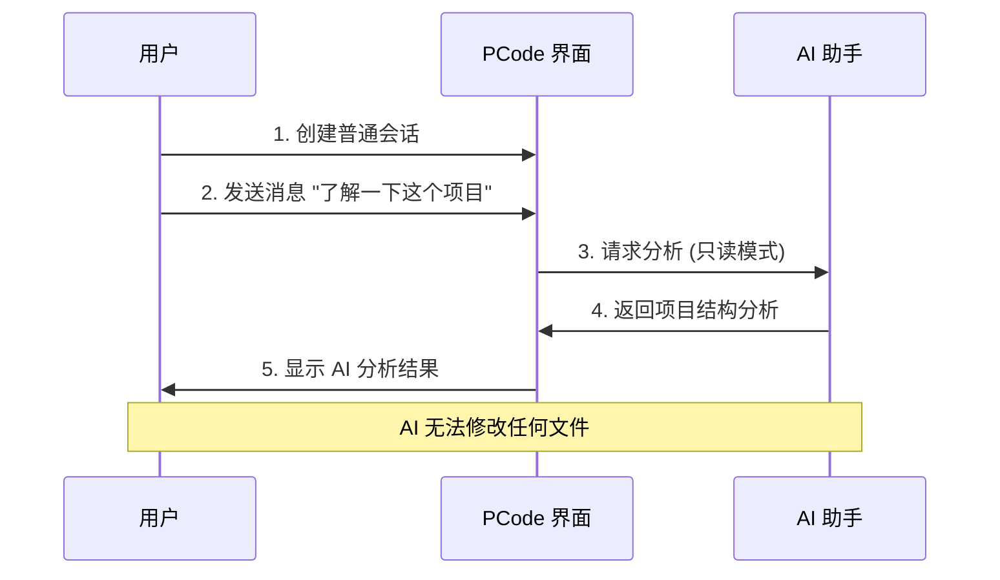
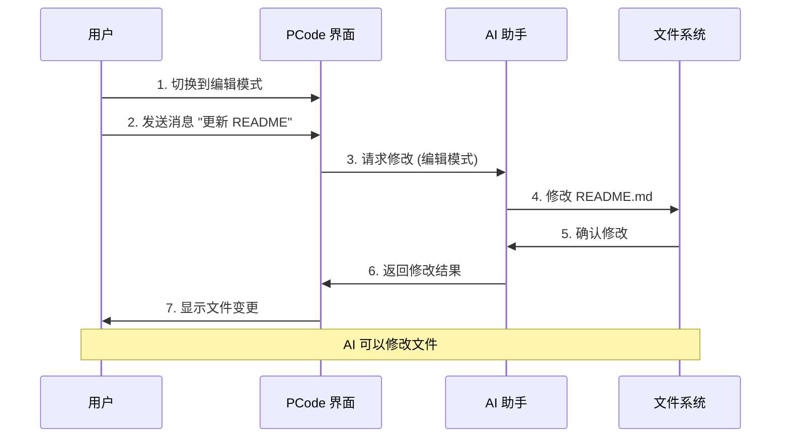

# Change: 更新创建普通会话的截图

## Why

当前"创建普通会话"文档缺少实际操作截图,无法直观展示 AI 在只读模式和编辑模式下的不同行为。用户难以通过纯文字理解两种模式的权限差异和实际使用场景。

## What Changes

- **新增截图演示**: 添加只读模式和编辑模式的实际操作截图
- **文档内容增强**: 在现有文档中集成截图,展示完整工作流
- **权限对比说明**: 通过截图清晰展示两种模式的操作差异
- **使用场景示例**: 添加具体的使用案例和对应的截图说明

具体变更:
1. **只读会话演示** (4-5 张截图)
   - 创建普通会话
   - 发送只读消息:"了解一下这个项目"
   - 展示 AI 分析并总结项目结构的过程
   - 说明只读模式的权限范围

2. **编辑权限会话演示** (3-4 张截图)
   - 请求 AI 更新 README 文件
   - 展示 AI 执行代码修改的操作
   - 说明编辑模式的权限范围

3. **文档整合**
   - 将截图嵌入到"创建普通会话"文档的相应章节
   - 添加截图说明文字和操作步骤
   - 更新模式切换流程的说明

## UI Design Changes

### 截图布局示例

```markdown
## 创建普通会话

### 步骤 1: 找到会话列表
在 PCode 界面的左侧,您会找到**会话列表**面板。


### 步骤 2: 点击"添加聊天"按钮
点击 **+ Add Chat** 按钮创建新的普通会话。


```

### 只读模式演示流程



### 编辑模式演示流程



## Impact

### Affected Specs
- `specs/docusaurus-site/spec.md` - 文档网站规范

### Affected Code
- `docs/quick-start/conversation-session.md` - 主要更新文档
- `static/img/create-normal-session/` - 新增截图资源 (已存在)

### Documentation Changes
- 在"创建普通会话"文档中添加 8-10 张截图
- 增强只读模式与编辑模式的对比说明
- 提供更清晰的操作步骤指引

### Performance Considerations
- 图片优化: 保持截图在合理大小 (建议每张 < 500KB)
- 懒加载: 使用 Docusaurus 的图片懒加载功能
- CDN 缓存: 静态资源可通过 CDN 优化加载

### User Experience Improvements
- 降低学习门槛: 可视化演示帮助用户快速理解
- 减少支持负担: 清晰的截图减少用户疑问
- 提升文档质量: 图文并茂提升阅读体验

## Success Criteria

1. ✅ 所有截图正确嵌入到文档中
2. ✅ 截图清晰展示只读模式和编辑模式的差异
3. ✅ 文档构建成功,无图片路径错误
4. ✅ 截图说明文字准确描述操作步骤
5. ✅ 用户反馈文档更易理解

## Migration Plan

### Phase 1: 截图整理 (已完成)
- ✅ 所有截图已存在于 `static/img/create-normal-session/` 目录
- ✅ 文件命名遵循 kebab-case 规范

### Phase 2: 文档更新
- 更新 `docs/quick-start/conversation-session.md`
- 在合适位置嵌入截图和说明

### Phase 3: 验证
- 本地构建文档,验证图片显示
- 检查文档在不同设备上的显示效果

## Notes

- 截图已由用户提前提供,无需重新制作
- 确保图片路径正确: `/img/create-normal-session/filename.png`
- 保持截图说明文字简洁明了
- 遵循 Docusaurus 文档编写规范
