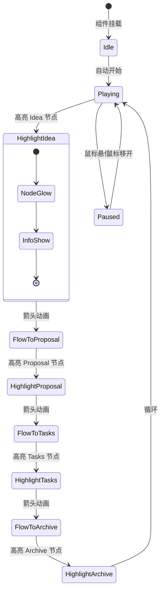
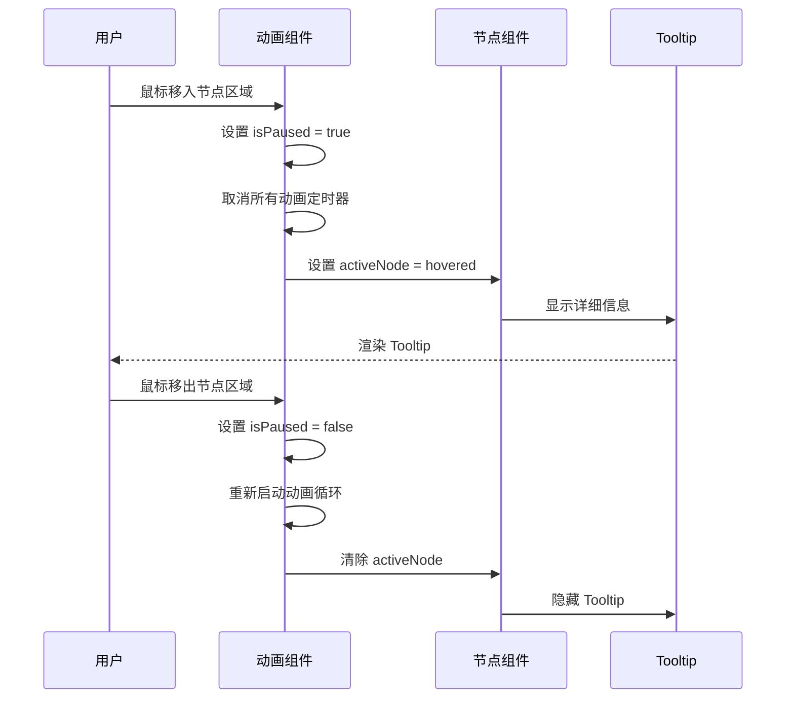
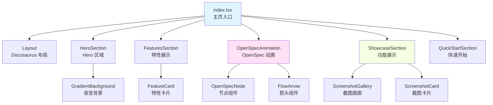
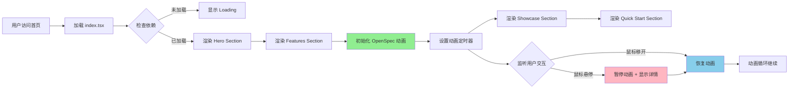

# Design: 首页重新设计 - OpenSpec 流程动画

## Overview

本文档详细描述 PCode 文档站点首页的重新设计，包括 UI/UX 设计、组件架构、动画实现和技术决策。主要目标是创建一个视觉吸引力强、信息丰富、交互流畅的首页，突出 PCode 的三大核心价值（智能、便捷、有趣）并通过动画演示 OpenSpec 工作流。

## Context

### Background

当前首页是 Docusaurus 默认模板的简单修改，仅包含基础的标题、描述和三个特性卡片。项目已收集到一批高质量的产品界面截图，但尚未在首页中有效利用。

### Constraints

- 必须使用 Docusaurus 3.0 + React 18.2 + TypeScript 5.3 技术栈
- 必须支持亮色和暗色主题切换
- 必须保持响应式设计，支持移动端、平板和桌面
- 应尽量减少首屏加载时间的影响
- 动画应尊重用户的 `prefers-reduced-motion` 设置

### Stakeholders

- 潜在用户：需要快速理解 PCode 的价值和功能
- 现有用户：需要快速访问文档和资源
- 项目维护者：需要易于维护和扩展的代码结构

## Goals / Non-Goals

### Goals

- 创建视觉吸引力强的首页，突出三大核心价值
- 实现流畅的 OpenSpec 流程动画，直观展示工作流
- 有效利用现有的产品截图资源
- 保持良好的性能和可访问性
- 支持响应式设计和主题切换

### Non-Goals

- 不创建完整的交互式产品演示（仅展示静态截图）
- 不实现复杂的 3D 效果或过度炫酷的动画
- 不修改 Docusaurus 的核心配置或主题系统
- 不创建新的自定义主题

## Decisions

### Decision 1: 使用 Framer Motion 作为动画库

**选择**：使用 Framer Motion 实现首页动画效果。

**理由**：
- Framer Motion 是 React 生态中最流行的动画库
- 提供声明式 API，易于使用和维护
- 内置支持手势交互（hover、tap、drag）
- 良好的 TypeScript 支持
- 自动优化动画性能
- 支持 CSS transforms 和 GPU 加速

**替代方案**：
- 纯 CSS 动画：更轻量，但缺乏声明式控制和状态管理
- React Spring：另一个选择，但 API 相对复杂
- GSAP：功能强大但过于重量级

### Decision 2: 组件化架构

**选择**：将首页拆分为多个独立的 React 组件。

**理由**：
- 提高代码可维护性
- 便于单独测试每个组件
- 支持组件复用
- 便于未来扩展和修改

**组件结构**：
```
src/components/home/
├── HeroSection.tsx          # Hero 区域
├── FeaturesSection.tsx      # 三大特性展示
├── OpenSpecAnimation.tsx    # OpenSpec 流程动画
│   ├── OpenSpecNode.tsx    # 单个节点组件
│   └── FlowArrow.tsx       # 箭头组件
├── ShowcaseSection.tsx      # 功能展示区域
│   └── ScreenshotGallery.tsx # 截图画廊
└── QuickStartSection.tsx    # 快速开始导航
```

### Decision 3: 响应式设计策略

**选择**：使用 CSS Grid 和 Flexbox 实现响应式布局，断点为 768px 和 1024px。

**理由**：
- 符合现代 Web 标准
- Docusaurus 主题已内置响应式支持
- 减少自定义媒体查询的复杂性

**布局规划**：
- 桌面端 (>1024px)：多列布局，水平动画
- 平板端 (768px-1024px)：2列布局，垂直动画
- 移动端 (<768px)：单列布局，简化动画

### Decision 4: 图片优化策略

**选择**：使用原生 lazy loading 和适当的图片尺寸。

**理由**：
- 浏览器原生支持，无需额外依赖
- 减少初始页面加载时间
- 现有截图已经过优化，无需进一步压缩

## UI/UX Design

### 首页整体布局

```
┌─────────────────────────────────────────────────────────────────────┐
│  PCode Logo                                    [Docs] [Blog] [GitHub]│
├─────────────────────────────────────────────────────────────────────┤
│  ┌───────────────────────────────────────────────────────────────┐  │
│  │                        Hero Section                          │  │
│  │  ╔═══════════════════════════════════════════════════════════╗ │  │
│  │  ║                                                           ║ │  │
│  │  ║    🚀 PCode                                              ║ │  │
│  │  ║    智能 · 便捷 · 有趣                                     ║ │  │
│  │  ║    用 AI 重新定义代码开发体验                             ║ │  │
│  │  ║                                                           ║ │  │
│  │  ║    [开始使用]              [了解更多]                     ║ │  │
│  │  ║                                                           ║ │  │
│  │  ╚═══════════════════════════════════════════════════════════╝ │  │
│  └───────────────────────────────────────────────────────────────┘  │
│                                                                     │
│  ┌───────────────────────────────────────────────────────────────┐  │
│  │                      Features Section                        │  │
│  │  ┌─────────────────┐  ┌─────────────────┐  ┌─────────────────┐ │  │
│  │  │  智能            │  │  便捷            │  │  有趣            │ │  │
│  │  │  ┌───────────┐  │  │  ┌───────────┐  │  │  ┌───────────┐  │ │  │
│  │  │  │    🧠     │  │  │  │    ⚡     │  │  │  │    🎮     │  │  │
│  │  │  └───────────┘  │  │  └───────────┘  │  │  └───────────┘  │ │  │
│  │  │                 │  │                 │  │                 │ │  │
│  │  │ AI 驱动的代码    │  │ 开箱即用的      │  │ 游戏化的开发    │ │  │
│  │  │ 智能助手         │  │ 项目配置        │  │ 体验            │ │  │
│  │  │                 │  │                 │  │                 │ │  │
│  │  │ • 会话管理      │  │ • 快速配置      │  │ • 成就系统      │ │  │
│  │  │ • 提案生成      │  │ • 主题定制      │  │ • 每日报告      │ │  │
│  │  │ • 工具调用      │  │ • 快捷切换      │  │ • 效率评级      │ │  │
│  │  └─────────────────┘  └─────────────────┘  └─────────────────┘ │  │
│  └───────────────────────────────────────────────────────────────┘  │
│                                                                     │
│  ┌───────────────────────────────────────────────────────────────┐  │
│  │                   OpenSpec Workflow Animation                 │  │
│  │  ┌─────────────┐    ┌─────────────┐    ┌─────────────┐       │  │
│  │  │  💡 Idea    │───>│  📄 Proposal│───>│  ⚙️ Tasks   │       │  │
│  │  │             │    │             │    │             │       │  │
│  │  │  从想法开始  │    │  AI 辅助    │    │  任务驱动   │       │  │
│  │  │  快速记录    │    │  生成提案   │    │  高效开发   │       │  │
│  │  └─────────────┘    └─────────────┘    └─────────────┘       │  │
│  │                           │                               │    │  │
│  │                           ▼                               │    │  │
│  │                    ┌─────────────┐                          │  │
│  │                    │  ✅ Archive │                          │  │
│  │                    │             │                          │  │
│  │                    │  自动归档   │                          │  │
│  │                    │  知识沉淀   │                          │  │
│  │                    └─────────────┘                          │  │
│  │                                                           │    │  │
│  │  [悬停查看详情 • 自动播放 • 循环演示]                     │    │  │
│  └───────────────────────────────────────────────────────────────┘  │
│                                                                     │
│  ┌───────────────────────────────────────────────────────────────┐  │
│  │                      Showcase Section                        │  │
│  │  ┌─────────────────────────────┐  ┌─────────────────────────┐ │  │
│  │  │   亮色主题主界面             │  │   暗色主题主界面         │ │  │
│  │  │   [亮色主题主界面.png]       │  │   [暗色主题主界面.png]   │ │  │
│  │  │   清新明亮的日间模式         │  │   护眼舒适的夜间模式     │ │  │
│  │  └─────────────────────────────┘  └─────────────────────────┘ │  │
│  │  ┌─────────────────────────────┐  ┌─────────────────────────┐ │  │
│  │  │   实时 Token 消耗报告        │  │   每日成就报告           │ │  │
│  │  │   [实时token消耗报告.png]    │  │   [每日成就报告.png]     │  │
│  │  │   透明的 AI 成本追踪         │  │   游戏化的成就展示       │  │
│  │  └─────────────────────────────┘  └─────────────────────────┘ │  │
│  │  ┌─────────────────────────────┐  ┌─────────────────────────┐ │  │
│  │  │   使用 AI 的效率提升报告     │  │   每日编写代码获得的成就  │  │
│  │  │   [使用 AI 的效率提升报告.png]│  │   [每日编写代码获得的成就.png]│ │  │
│  │  │   量化 AI 带来的效率提升     │  │   收集你的每一个里程碑    │  │
│  │  └─────────────────────────────┘  └─────────────────────────┘ │  │
│  └───────────────────────────────────────────────────────────────┘  │
│                                                                     │
│  ┌───────────────────────────────────────────────────────────────┐  │
│  │                     Quick Start Section                       │  │
│  │  ┌─────────────────────────────────────────────────────────┐  │  │
│  │  │  准备好了吗？开始你的 PCode 之旅                          │  │  │
│  │  │                                                         │  │  │
│  │  │  [📦 安装指南]    [🚀 创建项目]    [💻 开始编码]          │  │  │
│  │  └─────────────────────────────────────────────────────────┘  │  │
│  └───────────────────────────────────────────────────────────────┘  │
└─────────────────────────────────────────────────────────────────────┘
```

### Hero Section 详细设计

```
┌─────────────────────────────────────────────────────────────────────┐
│                                                                     │
│                          ╔═══════════════════════════╗              │
│                          ║                           ║              │
│                          ║    🚀 PCode              ║              │
│                          ║                           ║              │
│                          ║    智能 · 便捷 · 有趣     ║              │
│                          ║    用 AI 重新定义代码     ║              │
│                          ║    开发体验               ║              │
│                          ║                           ║              │
│                          ║    ┌──────────────┐       ║              │
│                          ║    │  开始使用     │       ║              │
│                          ║    └──────────────┘       ║              │
│                          ║                           ║              │
│                          ╚═══════════════════════════╝              │
│                                                                     │
│  [渐变背景：从透明到 --ifm-color-emphasis-100]                      │
│  [悬停按钮：轻微放大 + 阴影效果]                                     │
└─────────────────────────────────────────────────────────────────────┘
```

**交互状态**：
- 正常状态：按钮有轻微阴影，渐变背景
- 悬停状态：按钮放大 1.05 倍，阴影增强
- 点击状态：按钮缩小 0.95 倍，提供触觉反馈
- 焦点状态：显示焦点环（键盘导航）

### OpenSpec 动画详细设计

#### 动画状态机



#### 动画时间线

```
时间线：每个阶段 2 秒，总共 8 秒一个循环

0.0s ─────────────────────────────────────────────────────────────────
     │
     ├─ Idea 节点开始发光（scale: 1.0 → 1.1, opacity: 1.0）
     │
2.0s ├─ Idea 箭头开始移动（translateX: 0 → 100%）
     │
2.5s ├─ Proposal 节点开始发光
     │
4.0s ├─ Proposal 箭头开始移动
     │
4.5s ├─ Tasks 节点开始发光
     │
6.0s ├─ Tasks 箭头开始移动
     │
6.5s ├─ Archive 节点开始发光
     │
8.0s ─────────────────────────────────────────────────────────────────
     │
     └─ 循环重新开始
```

#### 悬停交互流程



### Showcase Section 详细设计

```
┌─────────────────────────────────────────────────────────────────────┐
│  PCode 功能展示                                                      │
│  ┌─────────────────────────────┐  ┌─────────────────────────┐       │
│  │  ╔═════════════════════════╗ │  │ ╔══════════════════════╗ │       │
│  │  ║                         ║ │  │ ║                     ║ │       │
│  │  ║   [亮色主题截图]        ║ │  │ ║   [暗色主题截图]    ║ │       │
│  │  ║                         ║ │  │ ║                     ║ │       │
│  │  ║   清新明亮的日间模式    ║ │  │ ║   护眼舒适的夜间模式 ║ │       │
│  │  ║                         ║ │  │ ║                     ║ │       │
│  │  ╚═════════════════════════╝ │  │ ╚══════════════════════╝ │       │
│  └─────────────────────────────┘  └─────────────────────────┘       │
│                                                                     │
│  [悬停效果：图片放大 1.05 倍，显示阴影]                              │
│  [点击效果：打开全屏图片预览（可选）]                                │
└─────────────────────────────────────────────────────────────────────┘
```

## Technical Design

### 组件架构



### 数据流



### Framer Motion 动画配置

#### OpenSpecNode 动画配置

```typescript
const nodeVariants = {
  inactive: {
    scale: 1,
    opacity: 0.6,
    boxShadow: '0 0 0 rgba(var(--ifm-color-primary), 0)',
  },
  active: {
    scale: 1.1,
    opacity: 1,
    boxShadow: '0 0 20px rgba(var(--ifm-color-primary), 0.5)',
    transition: {
      duration: 0.5,
      ease: 'easeInOut',
    },
  },
  hover: {
    scale: 1.15,
    opacity: 1,
    boxShadow: '0 0 30px rgba(var(--ifm-color-primary), 0.7)',
    transition: {
      duration: 0.3,
      ease: 'easeOut',
    },
  },
};
```

#### FlowArrow 动画配置

```typescript
const arrowVariants = {
  hidden: {
    pathLength: 0,
    opacity: 0,
  },
  visible: {
    pathLength: 1,
    opacity: 1,
    transition: {
      pathLength: {
        duration: 1.5,
        ease: 'easeInOut',
      },
      opacity: {
        duration: 0.3,
      },
    },
  },
};
```

### CSS 变量使用

```css
:root {
  /* 使用 Docusaurus 内置变量 */
  --home-hero-bg-start: var(--ifm-background-color);
  --home-hero-bg-end: var(--ifm-color-emphasis-100);
  --home-card-bg: var(--ifm-background-surface-color);
  --home-card-border: var(--ifm-color-emphasis-300);
  --home-primary-color: var(--ifm-color-primary);
  --home-text-color: var(--ifm-font-color-base);

  /* 自定义动画变量 */
  --home-animation-duration: 8s;
  --home-node-size: 120px;
  --home-arrow-width: 60px;
}

/* 暗色主题覆盖 */
[data-theme='dark'] {
  --home-hero-bg-end: rgba(0, 0, 0, 0.3);
}
```

### 响应式断点配置

```typescript
const breakpoints = {
  mobile: '(max-width: 767px)',
  tablet: '(min-width: 768px) and (max-width: 1023px)',
  desktop: '(min-width: 1024px)',
};

const responsiveConfig = {
  desktop: {
    nodesPerRow: 4,
    arrowDirection: 'horizontal',
    cardColumns: 3,
    screenshotColumns: 2,
  },
  tablet: {
    nodesPerRow: 2,
    arrowDirection: 'vertical',
    cardColumns: 2,
    screenshotColumns: 2,
  },
  mobile: {
    nodesPerRow: 1,
    arrowDirection: 'vertical',
    cardColumns: 1,
    screenshotColumns: 1,
  },
};
```

### 图片资源映射

```typescript
const screenshots = {
  lightTheme: {
    src: '/img/home/亮色主题主界面.png',
    alt: 'PCode 亮色主题主界面 - 清新明亮的日间模式',
    title: '亮色主题',
  },
  darkTheme: {
    src: '/img/home/暗色主题主界面.png',
    alt: 'PCode 暗色主题主界面 - 护眼舒适的夜间模式',
    title: '暗色主题',
  },
  tokenReport: {
    src: '/img/home/实时token消耗报告.png',
    alt: '实时 Token 消耗报告 - 透明的 AI 成本追踪',
    title: '实时消耗报告',
  },
  dailyReport: {
    src: '/img/home/每日成就报告.png',
    alt: '每日成就报告 - 游戏化的成就展示',
    title: '每日成就',
  },
  efficiencyReport: {
    src: '/img/home/使用 AI 的效率提升报告.png',
    alt: '使用 AI 的效率提升报告 - 量化 AI 带来的效率提升',
    title: '效率提升',
  },
  achievementBadges: {
    src: '/img/home/每日编写代码获得的成就.png',
    alt: '每日编写代码获得的成就 - 收集你的每一个里程碑',
    title: '成就徽章',
  },
};
```

## Risks / Trade-offs

### Risk 1: 动画性能影响

**风险**：复杂的动画可能在低端设备上导致性能问题。

**缓解措施**：
- 使用 CSS transforms 和 opacity（GPU 加速）
- 实现 `prefers-reduced-motion` 支持
- 提供关闭动画的选项
- 在低端设备上简化动画效果

### Risk 2: 首屏加载时间增加

**风险**：添加新组件和动画库可能增加首屏加载时间。

**缓解措施**：
- 使用动态导入（dynamic import）延迟加载非关键组件
- 利用代码分割（code splitting）
- 优化图片资源（已有图片已优化）
- 设置适当的加载优先级

### Risk 3: 可访问性问题

**风险**：动画可能对某些用户造成困扰或不适。

**缓解措施**：
- 尊重 `prefers-reduced-motion` 设置
- 为所有交互元素提供键盘导航
- 为所有图片提供 alt 文本
- 确保足够的颜色对比度
- 为动画提供暂停控制

### Risk 4: 维护复杂性

**风险**：自定义组件增加维护成本。

**缓解措施**：
- 保持组件简单和专注
- 使用 TypeScript 确保类型安全
- 添加充分的代码注释
- 遵循 Docusaurus 最佳实践
- 编写单元测试（如果需要）

## Migration Plan

### 迁移步骤

1. **备份现有首页**
   ```bash
   cp src/pages/index.tsx src/pages/index.tsx.backup
   ```

2. **安装依赖**
   ```bash
   npm install framer-motion
   npm install --save-dev @types/framer-motion
   ```

3. **创建组件目录结构**
   ```bash
   mkdir -p src/components/home
   ```

4. **创建样式文件**
   ```bash
   touch src/css/home.css
   ```

5. **逐个实现组件**（按 tasks.md 顺序）

6. **测试和验证**
   - 本地开发测试
   - 构建验证
   - 多浏览器测试
   - 响应式测试

7. **部署上线**

### 回滚计划

如果新首页出现问题：
1. 恢复备份的 `index.tsx`
2. 删除 `src/components/home/` 目录
3. 卸载 Framer Motion 依赖（可选）
4. 重新构建和部署

## Open Questions

1. **动画时长**：8 秒的循环时长是否合适？是否需要用户可配置的播放速度？

2. **移动端简化**：移动端是否应该完全隐藏动画，还是显示简化版本？

3. **图片预加载**：是否需要预加载 Showcase 区域的图片以改善用户体验？

4. **性能监控**：是否需要添加性能监控来追踪动画对页面性能的影响？

5. **A/B 测试**：是否需要进行 A/B 测试来验证新首页的效果？

## 附录：关键代码示例

### OpenSpecAnimation 组件骨架

```typescript
import React, { useState, useEffect } from 'react';
import { motion, AnimatePresence } from 'framer-motion';
import OpenSpecNode from './OpenSpecNode';
import FlowArrow from './FlowArrow';
import './home.css';

interface Stage {
  id: string;
  label: string;
  icon: string;
  description: string;
}

const stages: Stage[] = [
  { id: 'idea', label: 'Idea', icon: '💡', description: '从想法开始快速记录' },
  { id: 'proposal', label: 'Proposal', icon: '📄', description: 'AI 辅助生成提案' },
  { id: 'tasks', label: 'Tasks', icon: '⚙️', description: '任务驱动高效开发' },
  { id: 'archive', label: 'Archive', icon: '✅', description: '自动归档知识沉淀' },
];

export default function OpenSpecAnimation(): JSX.Element {
  const [activeStage, setActiveStage] = useState(0);
  const [isPaused, setIsPaused] = useState(false);

  useEffect(() => {
    if (isPaused) return;

    const interval = setInterval(() => {
      setActiveStage((prev) => (prev + 1) % stages.length);
    }, 2000);

    return () => clearInterval(interval);
  }, [isPaused]);

  return (
    <section className="openspec-animation">
      <h2>OpenSpec 工作流</h2>
      <div className="animation-container">
        {stages.map((stage, index) => (
          <React.Fragment key={stage.id}>
            <OpenSpecNode
              stage={stage}
              isActive={activeStage === index}
              isPaused={isPaused}
              onHover={() => setIsPaused(true)}
              onLeave={() => setIsPaused(false)}
            />
            {index < stages.length - 1 && (
              <FlowArrow isActive={activeStage === index} />
            )}
          </React.Fragment>
        ))}
      </div>
    </section>
  );
}
```
