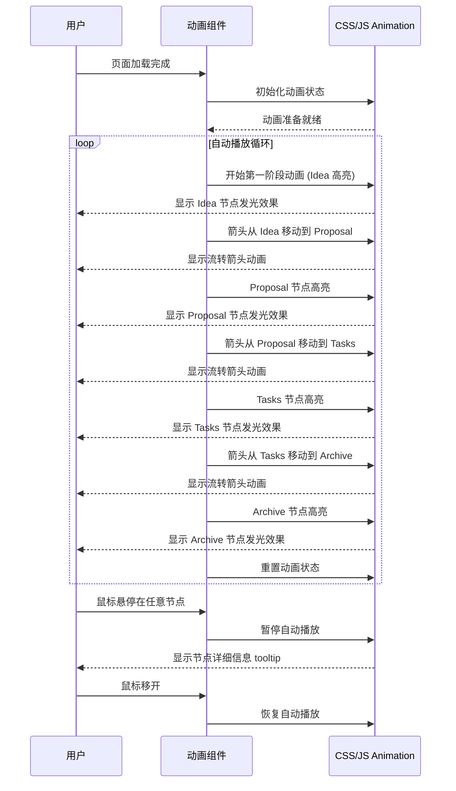
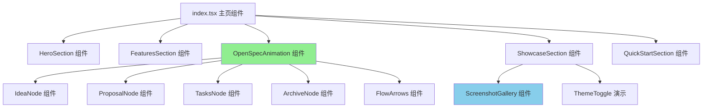
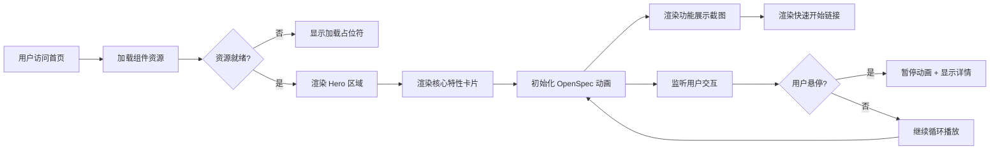

# Change: 对首页进行完整的重新设计

status: ExecutionCompleted

## Why

当前 PCode 文档站点首页内容较为基础，未能充分展示产品的核心价值主张。现有首页未突出 PCode 的三大核心价值特性（智能、便捷、有趣），特别是 OpenSpec 流程的高效性未能通过视觉化方式有效传达给用户。项目已收集到一批用户界面截图素材，但尚未在首页中有效利用。

## What Changes

- **新增核心价值展示区域**：在首页添加 Hero 区域和三大特性展示（智能、便捷、有趣）
- **新增 OpenSpec 流程可视化动画**：使用 Framer Motion 或类似库实现流转动画，展示从提案创建到实施的完整工作流
- **新增功能展示区域**：利用 `static/img/home/` 目录中的截图展示实际产品界面
- **新增互动元素**：包括动画效果、主题切换演示、响应式布局
- **重构现有首页组件**：将 `src/pages/index.tsx` 从简单静态页面改为功能丰富的自定义组件
- **新增动画依赖**：添加 Framer Motion 或类似动画库到项目依赖

## UI Design Changes

### 新首页布局结构

```
┌─────────────────────────────────────────────────────────────────────┐
│  PCode Logo                                    [Docs] [Blog] [GitHub]│
├─────────────────────────────────────────────────────────────────────┤
│                                                                     │
│                          ╔═══════════════════════════╗              │
│                          ║                           ║              │
│                          ║    🚀 PCode              ║              │
│                          ║    智能 · 便捷 · 有趣     ║              │
│                          ║                           ║              │
│                          ║  [开始使用] [了解更多]    ║              │
│                          ╚═══════════════════════════╝              │
│                                                                     │
│  ┌──────────────────┐  ┌──────────────────┐  ┌──────────────────┐  │
│  │   智能            │  │   便捷            │  │   有趣            │  │
│  │   AI 驱动         │  │   开箱即用        │  │   游戏化          │  │
│  │   会话管理        │  │   主题定制        │  │   成就系统        │  │
│  │   提案生成        │  │   快捷切换        │  │   每日报告        │  │
│  └──────────────────┘  └──────────────────┘  └──────────────────┘  │
│                                                                     │
│  ┌─────────────────────────────────────────────────────────────┐   │
│  │                    OpenSpec 工作流                          │   │
│  │                                                              │   │
│  │   ┌─────────┐    ┌─────────┐    ┌─────────┐    ┌─────────┐  │   │
│  │   │ 💡 Idea │───>│📄 Proposal│───>│⚙️ Tasks │───>│✅ Archive│ │   │
│  │   └─────────┘    └─────────┘    └─────────┘    └─────────┘  │   │
│  │         │              │              │              │        │   │
│  │         ▼              ▼              ▼              ▼        │   │
│  │   ┌─────────┐    ┌─────────┐    ┌─────────┐    ┌─────────┐  │   │
│  │   │AI 辅助   │    │ 自动化   │    │ 驱动     │    │ 归档     │  │   │
│  │   │生成      │    │ 评审     │    │ 开发     │    │ 文档     │  │   │
│  │   └─────────┘    └─────────┘    └─────────┘    └─────────┘  │   │
│  │                                                              │   │
│  │              [动画演示：流转过程，箭头移动，节点高亮]           │   │
│  └─────────────────────────────────────────────────────────────┘   │
│                                                                     │
│  ┌─────────────────────────────────────────────────────────────┐   │
│  │                        功能展示                              │   │
│  │  ┌─────────────────────┐  ┌─────────────────────┐          │   │
│  │  │  亮色主题主界面      │  │  暗色主题主界面      │          │   │
│  │  │  [screenshot]        │  │  [screenshot]        │          │   │
│  │  └─────────────────────┘  └─────────────────────┘          │   │
│  │                                                              │   │
│  │  ┌─────────────────────┐  ┌─────────────────────┐          │   │
│  │  │  实时 Token 消耗     │  │  每日成就报告        │          │   │
│  │  │  [screenshot]        │  │  [screenshot]        │          │   │
│  │  └─────────────────────┘  └─────────────────────┘          │   │
│  └─────────────────────────────────────────────────────────────┘   │
│                                                                     │
│  ┌─────────────────────────────────────────────────────────────┐   │
│  │                        快速开始                              │   │
│  │  [安装指南] [创建项目] [开始编码]                             │   │
│  └─────────────────────────────────────────────────────────────┘   │
└─────────────────────────────────────────────────────────────────────┘
```

### OpenSpec 流程动画交互



### 响应式布局变化

```
桌面端 (>1024px):
┌─────────────────────────────────────┐
│  3列网格布局展示核心特性              │
│  水平展示 OpenSpec 流程               │
│  2列网格布局展示功能截图              │
└─────────────────────────────────────┘

平板端 (768px-1024px):
┌─────────────────────────────────────┐
│  2列网格布局展示核心特性              │
│  垂直堆叠展示 OpenSpec 流程           │
│  单列布局展示功能截图                 │
└─────────────────────────────────────┘

移动端 (<768px):
┌─────────────────────────────────────┐
│  单列堆叠布局                         │
│  简化版 OpenSpec 流程                 │
│  单列布局展示功能截图（可横向滚动）     │
└─────────────────────────────────────┘
```

## 代码流程变更

### 组件架构



### 数据流



### 代码变更清单

| 文件路径 | 变更类型 | 变更原因 | 影响范围 |
|---------|---------|---------|---------|
| `src/pages/index.tsx` | 完全重构 | 从简单静态页面改为功能丰富的自定义组件 | 首页 |
| `src/components/home/HeroSection.tsx` | 新增 | Hero 区域展示标题、描述、CTA 按钮 | 首页顶部 |
| `src/components/home/FeaturesSection.tsx` | 新增 | 展示三大核心价值特性（智能、便捷、有趣） | 首页中部 |
| `src/components/home/OpenSpecAnimation.tsx` | 新增 | OpenSpec 流程可视化动画组件 | 首页中部 |
| `src/components/home/ShowcaseSection.tsx` | 新增 | 功能展示区域，使用 `static/img/home/` 截图 | 首页下部 |
| `src/components/home/QuickStartSection.tsx` | 新增 | 快速开始导航区域 | 首页底部 |
| `src/components/home/OpenSpecNode.tsx` | 新增 | OpenSpec 动画的单个节点组件 | 动画子组件 |
| `src/components/home/FlowArrow.tsx` | 新增 | OpenSpec 动画的箭头流转组件 | 动画子组件 |
| `src/css/home.css` | 新增 | 首页专用样式文件 | 样式 |
| `package.json` | 修改 | 添加 Framer Motion 依赖 | 项目配置 |

## Impact

- **Affected specs**: `docusaurus-site` (新增首页自定义组件需求)
- **Affected code**:
  - `src/pages/index.tsx` (完全重构)
  - 新增 `src/components/home/` 目录及多个子组件
  - `package.json` (新增动画库依赖)
- **Affected assets**: 使用 `static/img/home/` 目录中的现有截图
- **Performance**: 需要评估动画库对页面加载性能的影响，考虑代码分割和懒加载
