# Design: QQ Group Links Multiple Locations

## Context

The Hagicode documentation site currently lacks a direct entry point for users to join the technical support QQ group. Users who need immediate technical assistance or want to engage with the community cannot easily find this information through the website. This design adds QQ group links in three strategic locations: homepage, navbar, and footer.

## Goals / Non-Goals

**Goals:**
- Provide easy access to the QQ technical support group from multiple entry points
- Maintain visual consistency with existing site design
- Ensure responsive design across all screen sizes
- Use external links that open in new tabs to preserve user's place on the site

**Non-Goals:**
- Creating a new dedicated community page
- Implementing real-time chat features
- Adding other social media links at this time

## Decisions

### Decision 1: QQ Group Link Format

**Choice:** External link (`href`) to `https://qm.qq.com/q/Wk6twXHdyS`

**Alternatives considered:**
- Embedded QR code image: Would require users to scan with phone, less accessible
- QQ number only: Users would need to manually search and add the group
- Direct QQ protocol link: Not universally supported across browsers

**Rationale:** The QQ mobile group join link provides the best user experience as it:
- Works on both desktop and mobile devices
- Opens directly in the QQ app or provides fallback instructions
- Requires minimal user interaction (one click)

### Decision 2: Homepage Card Placement

**Choice:** Add QQ group card after the hero buttons in HeroSection component

**Alternatives considered:**
- Add as a separate section below Features: Less prominent
- Add within QuickStart section: Could be confused with navigation links
- Add in hero buttons row: Would make the hero section too crowded

**Rationale:** Placing the card immediately after the hero buttons:
- Maintains visual hierarchy (hero content first, then community call-to-action)
- Provides clear separation between main CTAs and community link
- Fits naturally in the existing HeroSection component structure

### Decision 3: Visual Design Style

**Choice:** Match existing card styles with gradient border effects

**Alternatives considered:**
- Plain card with no special styling: Would not stand out
- Bright/contrasting colors: Would clash with existing color scheme
- Minimal outline style: Would not match the site's playful aesthetic

**Rationale:** Using the existing design system:
- Maintains visual consistency across the site
- Leverages established CSS variables and animations
- Provides a polished, professional appearance
- Adapts properly to light/dark themes

## UI/UX Design

### Homepage QQ Group Card

The QQ group card will be added to the HeroSection component, positioned after the hero buttons.

```
┌─────────────────────────────────────────────────────────────┐
│                    HERO SECTION                             │
│                                                             │
│            🚀  Hagicode                                     │
│       智能 · 便捷 · 有趣                                      │
│   用 AI 重新定义代码开发体验                                    │
│                                                             │
│     [开始使用]           [了解更多]                           │
│                                                             │
│   ┌───────────────────────────────────────────────────┐    │
│   │  ┌─────────────────────────────────────────────┐  │    │
│   │  │           🤝 加入技术支持群组                  │  │    │
│   │  │                                             │  │    │
│   │  │   HagiCode 技术支持 QQ 群 610394020           │  │    │
│   │  │                                             │  │    │
│   │  │            [立即加入 ──>]                     │  │    │
│   │  └─────────────────────────────────────────────┘  │    │
│   └───────────────────────────────────────────────────┘    │
│                                                             │
└─────────────────────────────────────────────────────────────┘
```

**Component structure:**
```tsx
<div className={styles.qqGroupCard}>
  <div className={styles.qqGroupCardIcon}>🤝</div>
  <h3 className={styles.qqGroupCardTitle}>加入技术支持群组</h3>
  <p className={styles.qqGroupCardDescription}>
    HagiCode 技术支持 QQ 群 610394020
  </p>
  <a
    href="https://qm.qq.com/q/Wk6twXHdyS"
    target="_blank"
    rel="noopener noreferrer"
    className="button button--primary"
  >
    立即加入
  </a>
</div>
```

**Style specifications:**
- Border radius: 24px (matching feature cards)
- Padding: 2rem
- Max width: 500px
- Center alignment
- Gradient border on hover (using existing CSS variables)
- Subtle shadow effect
- Background color: `var(--ifm-background-surface-color)`

### Navbar QQ Group Link

The navbar will include a QQ group link in the right-aligned items section.

```
┌─────────────────────────────────────────────────────────────────────┐
│ Hagicode Docs    Docs    Blog    QQ群    GitHub                      │
└─────────────────────────────────────────────────────────────────────┘
```

**Configuration:**
```typescript
{
  href: 'https://qm.qq.com/q/Wk6twXHdyS',
  label: 'QQ群',
  position: 'right',
}
```

**Behavior:** External link opens in new tab by default (Docusaurus behavior)

### Footer QQ Group Link

The footer Community section will include the QQ group link alongside GitHub.

```
┌─────────────────────────────────────────────────────────────────────┐
│  Community                      │  More                              │
│  GitHub                         │  Blog                             │
│  QQ技术支持群 (610394020)        │                                   │
└─────────────────────────────────────────────────────────────────────┘
```

**Configuration:**
```typescript
{
  title: 'Community',
  items: [
    {
      label: 'GitHub',
      href: 'https://github.com/Hagicode-org/hagicode-docs',
    },
    {
      label: 'QQ技术支持群 (610394020)',
      href: 'https://qm.qq.com/q/Wk6twXHdyS',
    },
  ],
}
```

### Responsive Design

**Desktop (>1024px):**
- Homepage card: Centered, max-width 500px
- Navbar: Visible alongside other right-aligned items
- Footer: Listed with other community links

**Tablet (768px-1024px):**
- Homepage card: Full width with padding, maintains aspect ratio
- Navbar: May be in dropdown menu depending on space
- Footer: Stacked with other community links

**Mobile (<768px):**
- Homepage card: Full width, reduced padding for smaller screens
- Navbar: In mobile menu (hamburger menu)
- Footer: Stacked vertically

### User Interaction Flow

```mermaid
sequenceDiagram
    participant User
    participant Homepage
    participant Navbar
    participant Footer
    participant QQ

    User->>Homepage: Views homepage
    Homepage->>User: Displays QQ group card
    User->>Homepage: Clicks "立即加入" button
    Homepage->>QQ: Opens new tab to QQ join link

    User->>Navbar: Looks for community link
    Navbar->>User: Shows "QQ群" in navbar
    User->>Navbar: Clicks "QQ群"
    Navbar->>QQ: Opens new tab to QQ join link

    User->>Footer: Scrolls to footer
    Footer->>User: Shows "QQ技术支持群" link
    User->>Footer: Clicks link
    Footer->>QQ: Opens new tab to QQ join link
```



### Hover States and Animations

**Homepage card hover:**
- Gradient border appears (matching feature cards)
- Subtle lift effect (translateY -5px)
- Shadow intensifies
- Icon scales slightly (1.1x)

**Navbar link hover:**
- Color change to accent color
- Underline animation

**Footer link hover:**
- Color change to accent color
- Subtle background highlight

### Accessibility Considerations

**Keyboard navigation:**
- All links are keyboard accessible via Tab key
- Visible focus indicators
- Enter key activates links

**Screen readers:**
- Descriptive link text ("立即加入", "QQ群", "QQ技术支持群")
- Alt text not needed (text-based links)
- Semantic HTML structure maintained

**Color contrast:**
- All text meets WCAG AA contrast requirements
- Gradient effects do not reduce text readability
- Works in both light and dark themes

## Technical Design

### Component Architecture


### File Modifications

**1. `docusaurus.config.ts`**
- Modify `themeConfig.navbar.items` array
- Modify `themeConfig.footer.links` array

**2. `src/components/home/HeroSection.tsx`**
- Add QQ group card component after hero buttons
- Import Link component from Docusaurus

**3. `src/components/home/home.module.css`**
- Add styles for QQ group card (if not reusing existing card styles)

### CSS Integration

The QQ group card will leverage existing CSS variables:
- `--pc-gradient-1`, `--pc-gradient-2`, `--pc-accent` for colors
- `--pc-card-shadow`, `--pc-card-shadow-hover` for shadows
- `--pc-transition-normal` for animations

New CSS classes to add (if needed):
```css
.qqGroupCard {
  /* Match featureCard styles */
  position: relative;
  background: var(--ifm-background-surface-color);
  border-radius: 24px;
  padding: 2rem;
  text-align: center;
  margin: 2rem auto 0;
  max-width: 500px;
  transition: all var(--pc-transition-normal);
}

.qqGroupCard:hover {
  transform: translateY(-5px);
  box-shadow: var(--pc-card-shadow-hover);
}
```

## Risks / Trade-offs

**Risk 1:** QQ link may become invalid over time
- **Mitigation:** Store QQ group link in a single location (config file) for easy updates
- **Monitoring:** Periodic checks to verify link functionality

**Risk 2:** Too many CTAs on homepage may confuse users
- **Mitigation:** Clear visual hierarchy with QQ card styled differently from primary CTAs
- **Positioning:** QQ card is secondary, placed below main navigation buttons

**Risk 3:** Mobile menu may become crowded
- **Mitigation:** Test on various mobile devices; adjust position if needed
- **Fallback:** Can move to less prominent position if space is constrained

**Trade-off:** External links open in new tabs
- **Pro:** Users don't lose their place on the documentation site
- **Con:** May be blocked by some popup blockers
- **Resolution:** Use standard `target="_blank"` with `rel="noopener noreferrer"` for security

## Migration Plan

**Step 1:** Update `docusaurus.config.ts` navbar and footer configurations
**Step 2:** Add QQ group card component to HeroSection
**Step 3:** Add CSS styles for the new card (if needed)
**Step 4:** Test locally with `npm start`
**Step 5:** Verify responsive behavior on different screen sizes
**Step 6:** Run `npm run build` to ensure no build errors
**Step 7:** Commit changes and create PR

**Rollback:** If issues arise, simply revert the configuration changes and component modifications.

## Open Questions

None - the requirements are clear and the design follows established patterns from the existing site.
